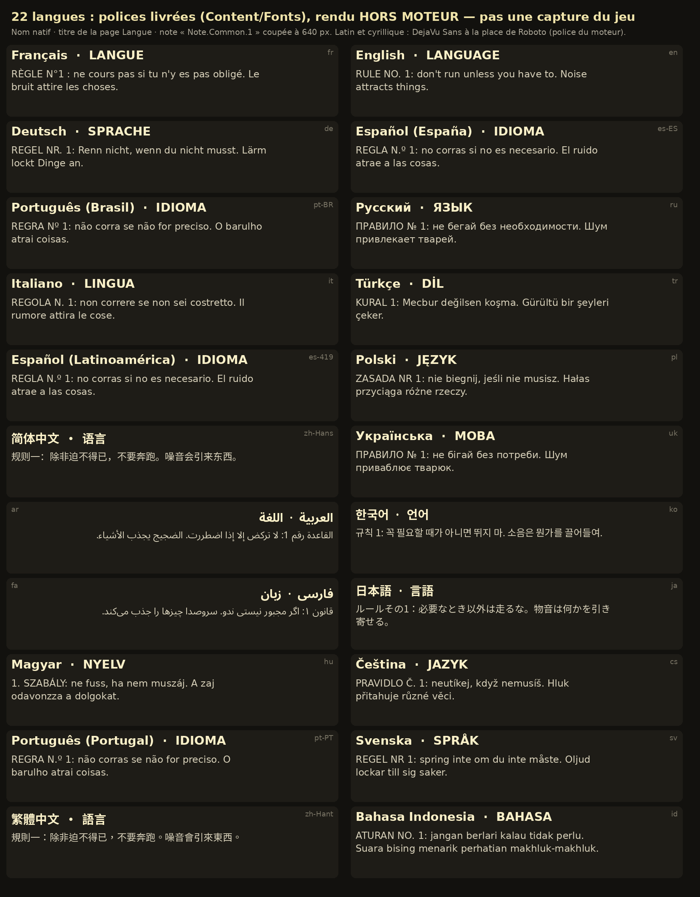

# Rapport v4.8 : combinaison texturée, fluidité RTX, 22 langues

Travail fait le 5 octobre 2026 sur la branche `backrooms`, à partir de `863c4db` (« Compilation sous Unreal 5.8.3 »).
L'état des lieux est dans [`AUDIT_v4.8.md`](AUDIT_v4.8.md).

Commits : `645df92` (1/6), `c806edb` (2/6), `076fe60` (3/6), `4f48ce7` (4/6), `8f65dc1` (4b/6), `98aa4cd` (5/6),
`448975b` (6a/6), puis 6/6 (ce rapport, README, planche des langues).

## 1. Ce qui n'a pas pu être fait ici

**Unreal Engine n'est pas disponible dans ce conteneur** (Linux, sans carte graphique ni moteur).

Les points suivants sont donc **non vérifiés** :

- la compilation (Unreal Header Tool, MSVC) ;
- l'import des ressources et la compilation des matériaux et des shaders ;
- le jeu en PIE, en Standalone et en version empaquetée ;
- les captures dans le moteur ;
- les mesures d'images par seconde, en particulier sur la RTX 4080 et le Ryzen 7 7800X3D.

**Aucun chiffre d'images par seconde ni aucune capture du jeu n'est donné dans ce rapport.** La section 7 donne
chaque commande à lancer. La seule image jointe (§ 5.4) est une planche rendue hors moteur, présentée comme telle.

## 2. Tableau des bogues

Colonne « Vérification » :

- **hors moteur** : contrôle fait ici ;
- **test** : étape du test automatique qui le vérifie dans le jeu (à lancer, § 7) ;
- **à l'œil** : à regarder en jeu.

### 2.1 Combinaison et matériaux

| # | Déclencheur et symptôme | Avant | Après | Fichiers | Vérification |
|---|---|---|---|---|---|
| M1 | Lancement en Standalone (`-game`) ou version empaquetée : combinaison du joueur sombre et sans texture, surtout dans les Poolrooms (capture fournie). | Les matériaux maîtres `M_BR_Mesh` et `M_BR_Skin` ne déclaraient que l'usage « instances ». Sur un maillage à squelette, le moteur ne pouvait pas recompiler hors de l'éditeur : il affichait le matériau par défaut. | Usages « maillage à squelette » et « Nanite » déclarés par l'import Python **et** par la construction C++ (`MATERIAL_VERSION 7`, reconstruction automatique). Au chargement, les usages sont vérifiés : ajoutés en mémoire dans l'éditeur, signalés sinon. | `backrooms_setup.py`, `BRMaterialBuilder.cpp`, `BRAssets.cpp` | test `v4.8 combinaison : materiaux` ; à l'œil (captures `V48_combinaison_L00`, `V48_combinaison_L37`) |
| M2 | Un slot sans nom ou inattendu sur `SK_Hazmat`. | Style `Body` presque noir (0,008) : l'erreur passait pour une combinaison sombre. | Slots affectés **par nom** (`HazmatSuit`, `HazmatMask`, `HazmatGlass`), jamais par indice. Un slot inattendu reçoit le **matériau d'erreur** (magenta hors Shipping) et il est signalé. | `BRAssets.cpp` (`ApplySlotMap`, `ErrorMaterial`), `BRCharacter.cpp` | test (aucun matériau d'erreur ni par défaut) |
| M3 | Une section mal habillée. | Aucune trace ne disait quel matériau chaque section avait reçu. | `DescribeSections` : une ligne par section (LOD, slot, matériau final, parent, texture, usage, secours) dans le journal, le mode développeur et le rapport du test. | `BRAssets.cpp` | test (lignes recopiées dans `Rapport.txt`) |
| M4 | Installation incomplète ou interrompue. | Le marqueur d'installation était écrit sans rien valider. Seul `run(force=True)` réparait, en réimportant tout. | `backrooms_setup.validate()` contrôle textures, maillages, slots, usages et carte, et écrit `Saved/BackroomsSetup_Validation.txt`. `repair()` ne refait que ce qui manque, puis valide de nouveau. Le marqueur n'est écrit qu'après une validation réussie. | `backrooms_setup.py` | `py_compile` hors moteur ; dans l'éditeur, non vérifié (§ 7.1) |

### 2.2 Sauvegardes et réseau

| # | Déclencheur et symptôme | Avant | Après | Fichiers | Vérification |
|---|---|---|---|---|---|
| B1 | Partie écrite par une version plus récente du jeu, ouverte par une version plus ancienne. | Lue « telle quelle », puis **réécrite au format ancien** à la sauvegarde suivante : ce que la version récente y avait mis était perdu. | Fichier **préservé** : la partie est en lecture seule et toute écriture est refusée, immédiate ou de fond. Le refus est gardé comme échec et montré au joueur, dans sa langue. | `BRSave.*`, `BRPlayerController.cpp` | test `partie d'un format plus recent` (fichier identique octet pour octet, aucune copie écrite) |
| B2 | Échec d'écriture (disque plein, dossier protégé, fichier verrouillé) suivi d'une écriture réussie. | `LastOk` était écrasé à chaque écriture : l'échec disparaissait **sans message**. | Chaque échec est gardé avec l'emplacement, le numéro de la demande, la cause et le fichier, jusqu'à ce qu'il soit **montré puis acquitté**. Une réussite ne l'efface plus. | `BRSave.*`, `BRPlayerController.cpp` | test `echec d'ecriture garde` (dossier à la place du fichier temporaire) |
| B3 | Un client demande son réveil juste après sa mort. | Le serveur avertissait sous 2 s, mais acceptait tout. Un client modifié pouvait se relever avant la fin du délai de réanimation. | Délai minimal selon la cause, contrôlé par le serveur : le délai de réanimation (30 s pour une blessure ou la folie, 20 s pour une noyade) quand un coéquipier vivant pouvait venir, 6 s sinon, moins 1,5 s de marge. Trop tôt : la demande est refusée et le joueur reste à terre le temps restant (`ClientRespawnDenied`). | `BRCharacter.*`, `BRWorld.*` | test réseau `reveil premature` |
| B4 | Coup d'une entité sur un client. | Le serveur transmettait le coup **sans toucher la santé**, que seul le client tenait. Un client modifié pouvait ignorer les coups. | Le serveur retire la santé (gilet compris) et décide si le coup tue. Le client reçoit l'effet du coup et sa **nouvelle santé**, et l'applique telle quelle : pas de double application. Les soins passent par le serveur (plafonnés, un par seconde). | `BRCharacter.*` | test réseau `coup decide par le serveur` (santé vue par le serveur 3 s après le coup) |
| B5 | Nom de l'entité qui frappe et du sauveteur, en coop. | Envoyés en **texte français**. | Seuls des identifiants circulent (type d'entité, cause). Chaque machine compose le texte dans **sa** langue. | `BRCharacter.*`, `BRHUD.cpp` | test réseau `langue de chaque machine` |

### 2.3 Fluidité

| # | Déclencheur et symptôme | Avant | Après | Fichiers | Vérification |
|---|---|---|---|---|---|
| P1 | Saccades en marchant (nouveaux chunks). | Toute la planification d'un chunk se faisait d'un bloc. Le budget n'était vérifié qu'entre deux chunks. | Planification par colonnes de cellules, dans le budget. | `BRChunk.*` | test (pire image de planification dans le rapport) |
| P2 | Pic à la création d'un lot de murs ou de sols. | Un lot entier était créé d'un coup : toutes les instances et toutes les collisions. | Sous-lots dimensionnés d'après le coût mesuré d'une instance. Objets et sorties créés un par un. | `BRChunk.*` | test |
| P3 | Pic quand des zones sortent de la vue. | Tous les chunks trop loin étaient détruits dans la même image. | Démontage étalé : quelques composants par image, dans le budget restant. | `BRChunk.*`, `BRWorld.*` | test (`MaxTeardownMs`, colonne `demontage_max_ms`) |
| P4 | Coop à plusieurs joueurs éloignés. | Les collisions des 3 × 3 chunks autour de **chaque** joueur étaient forcées sans budget (jusqu'à 36 chunks dans une image). Le tri ne regardait que le premier joueur. | Seul le chunk **occupé** est forcé, jusqu'à ses collisions. La priorité va aux chunks où les joueurs vont arriver (position prédite), pour tous les joueurs. | `BRWorld.*` | test (collisions préparées à l'avance) |
| P5 | Image longue sur une machine chargée. | Budget fixe de 3 ms. | **Budget partagé par image** : planification, création et démontage. Il baisse quand l'image dépasse 16,7 ms et remonte quand il y a de la marge (`-BRFrameBudget=<ms>`). | `BRWorld.*` | test (colonne `hors_budget`) |
| P6 | Première apparition d'une entité, d'un son ou d'une texture. | Chargement **synchrone** au premier besoin, en pleine partie. | Préchargement asynchrone de `/Game/Backrooms` dès le menu. Les chargements synchrones restants sont comptés (nombre, pire durée, noms). | `BRAssets.*` | test (`chargements_sync`) |
| P7 | Saccades de compilation de shaders. | Aucune précompilation des PSO. | `r.PSOPrecaching` ; un objet dont les shaders ne sont pas prêts attend d'être dessiné. À l'arrivée dans un niveau, l'écran noir est tenu (8 s au plus) le temps des compilations. Clés stables activées pour un cache de PSO du paquet (§ 7.4). | `DefaultEngine.ini`, `BRWorld.*` | test (attente des shaders à l'arrivée) |
| P8 | Changement de profil en jeu. | Le type des lumières (surfaciques ou ponctuelles) et le modèle du Hound étaient décidés à la création : un changement ne touchait que les zones chargées ensuite. | Les lumières des chunks déjà construits sont recréées (un chunk par image). Le Hound présent change de modèle (complet ou allégé). | `BRChunk.*`, `BRWorld.*`, `BREntity.*` | test `profils` (4 profils, chunks et Hound déjà chargés) |
| P9 | Néons en grand nombre. | Pas de distance d'ombre. | Ombres coupées au-delà d'une distance par profil : 15 m en Performance, 25 m en Qualité et RTX fluide, 40 m en Cinématique. | `BRWorld.*`, `BRChunk.*` | test (ombres locales comptées) |
| P10 | Reflets en Qualité. | Entités et eau translucide **noires dans les reflets** : le cache de surfaces ne les éclaire pas. | Entités hors de la scène ray tracée sans *hit lighting* ; eau hors de la scène ray tracée ; matériau du monde simplifié pour les rayons ; LOD minimal ray tracé des maillages à squelette. | `BREntity.cpp`, `BRChunk.cpp`, `BRMaterialBuilder.cpp`, `DefaultEngine.ini` | à l'œil |
| P11 | Jeu empaqueté sans import. | `LoadRawTexture` (mips calculés sur le processeur) pouvait servir dans un paquet. | `RawAssets` n'est jamais lu dans un jeu empaqueté. | `BRAssets.cpp` | non vérifié (paquet) |

### 2.4 Langues et texte

| # | Déclencheur et symptôme | Avant | Après | Fichiers | Vérification |
|---|---|---|---|---|---|
| L1 | Toute l'interface. | Environ 620 chaînes françaises en dur, assemblées par `FString::Printf`. | 676 textes `NSLOCTEXT("BR", <clé stable>, <français>)`. Arguments nommés, pluriels ICU, nombres et dates au format de la langue. | tous les fichiers d'interface | hors moteur (`loc_build.py --check`) ; test (22 langues) |
| L2 | Notes du journal. | Enregistrées par leur **texte français**. | Enregistrées par identifiant (`Note.L0.3`), au format de sauvegarde 3. Les anciennes parties sont converties ; un texte inconnu est gardé tel quel. | `BRSave.*`, `BRLevels.*`, `BRCharacter.cpp` | test `notes d'une sauvegarde v4.7` |
| L3 | Arabe et persan. | Dessin caractère par caractère : lettres non liées, ordre gauche-droite. | Mise en forme bidirectionnelle (HarfBuzz, comme Slate) ; paragraphes alignés à droite. | `BRHUD.cpp` | hors moteur (planche § 5.4) ; test (largeur mise en forme) ; à l'œil |
| L4 | Chinois et japonais. | Coupure des lignes seulement aux espaces : une ligne chinoise ne se coupait jamais. | Règles Unicode de coupure (ICU) : entre les idéogrammes, jamais devant une ponctuation fermante. Graphèmes jamais coupés (ellipse, espacement, libellés verticaux). | `BRHUD.cpp` | test (lignes ≤ largeur, aucun caractère perdu, aucune ponctuation en début de ligne) |
| L5 | Écritures non latines. | Roboto seul : ni CJK ni arabe. | Police composite : Roboto + Noto Sans Arabic, SC, TC, JP, KR. Les idéogrammes prennent la forme de la langue courante. | `BRFonts.*`, `Content/Fonts` | hors moteur (0 glyphe absent) ; test (polices présentes dans le paquet) |
| L6 | Libellés longs (espagnol, allemand, russe). | Débordement des cases des paramètres et des boutons. | Taille réduite jusqu'à 72 %, puis points de suspension. | `BRHUD.cpp` (`FitSize`, `TextFit`) | hors moteur (mesures avec les polices) ; test (capture `V48_parametres_es`) |
| L7 | Page Langue en japonais ou en chinois traditionnel : le nom natif « 简体中文 » demande 简 (U+7B80), absent des polices TC et JP réduites. | Trouvé par le contrôle des glyphes avant livraison : un carré à la place du caractère. | Ce caractère passe à la police SC. | `BRFonts.cpp` | hors moteur |

### 2.5 Divers

| # | Déclencheur et symptôme | Avant | Après | Fichiers | Vérification |
|---|---|---|---|---|---|
| D1 | Build unity : `ProfileNames` défini dans deux fichiers du module. | Erreur de compilation possible (même famille que `Ink`). | Renommé. | `BRAutoTest.cpp` | hors moteur (contrôle unity : 0) |
| D2 | `Rapport.txt` du test avec le profil RTX fluide. | Profil borné à 3 : « RTX fluide » apparaissait comme « Personnalisé ». | Nom exact. | `BRAutoTest.cpp` | hors moteur |

## 3. Combinaison texturée

La cause principale est M1. Les textures `T_Hazmat_Suit` et `T_Hazmat_Mask` (4096², sRGB) et les noms de slots du FBX
étaient sains.

Pour la réparer sur une installation existante, il suffit d'ouvrir l'éditeur. L'import voit `MATERIAL_VERSION 7` et
reconstruit les matériaux maîtres avec leurs usages. On peut aussi lancer, dans l'Output Log (onglet Python) :

```python
import backrooms_setup
backrooms_setup.validate(verbose=True)   # liste les problèmes, écrit Saved/BackroomsSetup_Validation.txt
backrooms_setup.repair()                 # ne refait que ce qui manque, puis valide de nouveau
```

Les modèles fournis (`RawAssets`, protégés par `Tools/protect_assets.py`) ne sont pas modifiés.

**Non vérifié** : le nom réel des slots après l'import Interchange de 5.8, et le rendu final. Le diagnostic par section
(M3) les donne au premier lancement : journal `LogBackrooms`, et `Rapport.txt` du test.

## 4. Fluidité RTX

### 4.1 Profil « RTX fluide »

Nouveau profil, pensé pour une RTX 4080 et un 7800X3D à 60 images par seconde ou plus :

| Profil | Qualité | Lumen | Reflets | Ombres de la lampe | Rendu (TSR) | Néons surfaciques | Ombres des néons | Hound |
|---|---|---|---|---|---|---|---|---|
| Performance | Élevé | logiciel | cache de surfaces | VSM | 67 % | non | 15 m | allégé |
| Qualité | Épique | ray tracing matériel | cache de surfaces | VSM | 80 % | oui | 25 m | allégé |
| **RTX fluide** | Épique | ray tracing matériel | cache de surfaces | VSM | **67 %** | oui | 25 m | allégé |
| Cinématique | Cinématique | ray tracing matériel | *hit lighting* | ray tracées | 100 % | oui | 40 m | complet |

« RTX fluide » garde le ray tracing matériel de Lumen. Il retire les deux réglages les plus chers : l'éclairage des
reflets par les rayons (*hit lighting*) et les ombres ray tracées de la lampe. Il rend à 67 % avec TSR.

La résolution interne est affichée dans les paramètres. Les modèles complets des entités sont un réglage à part.

### 4.2 Mesures

**Non vérifié.** Aucune mesure n'a pu être faite ici.

Le test v4.8 mesure le profil RTX fluide pendant une course de 20 s au Niveau 0 et dans les Poolrooms. Il signale un
problème si 95 % des images ne tiennent pas sous 16,7 ms, mais seulement quand le ray tracing matériel est disponible.
Commandes au § 7.2.

À reporter dans le tableau ci-dessous, depuis `Saved/AutoTest/Mesures.csv` et `Rapport.txt`, sur la machine cible
(RTX 4080, 7800X3D, 1920 × 1080 puis 2560 × 1440, graine 4605) :

| Scène | Profil | img/s | médiane (ms) | 95 % (ms) | 1 % le plus lent (img/s) | GPU (ms) | images hors budget | pire démontage (ms) | chargements synchrones |
|---|---|---|---|---|---|---|---|---|---|
| Niveau 0, course 20 s | RTX fluide | *à mesurer* | | | | | | | |
| Poolrooms, vue fixe | RTX fluide | *à mesurer* | | | | | | | |
| Niveau 0, vue fixe | Qualité | *à mesurer* | | | | | | | |
| Niveau 0, vue fixe | Cinématique | *à mesurer* | | | | | | | |

## 5. Langues

### 5.1 Ce qui est livré

- **22 langues** : français (source), anglais, allemand, espagnol (Espagne et Amérique latine), portugais (Brésil et
  Portugal), italien, russe, ukrainien, polonais, tchèque, hongrois, suédois, turc, indonésien, chinois simplifié,
  chinois traditionnel, japonais, coréen, arabe, persan.
- **Détection** de la langue du système au premier lancement : fr-CA → fr, es-MX → es-419, zh-TW → zh-Hant… À défaut,
  l'anglais.
- **Changement en jeu**, tout de suite : carte LANGUE du menu principal, page Langue avec les noms natifs, et ligne
  Langue dans les paramètres.
- **Choix enregistré** dans `BackroomsPlayer.ini`, propre à chaque machine : en coop, chacun garde sa langue.
- **Couverture et relecture affichées** sur la page Langue : « traduction automatique, à relire » tant qu'une langue
  n'est pas marquée relue.

### 5.2 Couverture : produit et relu sont distincts

Détail par langue : [`LOCALISATION_COUVERTURE.md`](LOCALISATION_COUVERTURE.md), écrit par `loc_build.py`.

| Mesure | Résultat |
|---|---|
| Textes du jeu | 676 (31 676 caractères en français) |
| Traduits (compilés dans `Game.locres`) | **676 / 676 dans chacune des 21 langues** |
| Refusés par les contrôles (arguments, pluriels, espaces) | 0 |
| **Relus par une personne qui parle la langue** | **0** : toutes les traductions sont produites automatiquement et marquées `fuzzy` |

Pour marquer une langue relue :

1. retirer `fuzzy` des entrées relues dans `Content/Localization/Game/<code>/Game.po` ;
2. ajouter `+ReviewedCultures=<code>` dans `Config/DefaultGame.ini`, section `[/Script/Backrooms.BRLocalization]`.

### 5.3 Ce qui n'est pas traduit

- **Voix** : il n'y a pas de doublage, et les sons du jeu n'ont pas de paroles.
- **Noms propres** : entités, Poolrooms, sigles techniques. Les noms des langues sont toujours écrits dans leur propre
  écriture.
- **Journal du jeu** (`LogBackrooms`) : reste en français, pour les rapports de bogues.

### 5.4 Planche hors moteur



**Ce n'est pas une capture du jeu.** La planche est rendue par Pillow et libraqm (HarfBuzz et FriBiDi, comme le
moteur pour l'arabe), avec les polices livrées dans `Content/Fonts`. DejaVu Sans y remplace Roboto, la police du
moteur, absente du dépôt.

Pour chaque langue, elle montre : le nom natif, le titre de la page Langue, et une note coupée à 640 px.

Elle vérifie trois points :

- chaque caractère trouve son glyphe (**0 glyphe absent**) ;
- l'arabe et le persan sont liés et alignés à droite ;
- le chinois et le japonais se coupent entre les caractères.

Elle ne vérifie pas le rendu du jeu lui-même (Slate, police composite), qui reste à voir sur les captures du test.

## 6. Vérifié ici, et comment

| Contrôle | Moyen | Résultat |
|---|---|---|
| Syntaxe C++ | `clang++ -std=c++20 -fsyntax-only`, en-têtes Unreal simplifiés, `-Wshadow-all` | 22 fichiers `.cpp` sur 25 sans erreur ni avertissement (en-têtes compris), dont `BRAutoTestV48.cpp`, `BRHUD.cpp`, `BRFonts.cpp` et `BRLoc.cpp`. Les 3 autres (`BRConfig`, `BRGameMode`, `BRWaterSim`) butent sur des lacunes connues des en-têtes simplifiés, comme en v4.7. |
| Variables masquées entre fichiers (build unity) | script maison | 0 |
| Sources en ASCII (échappements `\uXXXX`) | `grep -P '[^\x00-\x7F]'` | aucun caractère hors ASCII |
| Catalogues et `.locres` | `python Tools/Localization/loc_build.py --check` | 22 langues, 676 / 676, 0 refusé, 0 à revoir ; chaque `.locres` relu après écriture |
| Clés extraites | `loc_extract.py` | 676 clés, aucun conflit (même clé, sources différentes) |
| Glyphes des polices | `build_fonts.py` puis `render_language_sheet.py` | chaque caractère des catalogues couvert ; 0 glyphe absent sur la planche |
| Largeur des libellés | mesures Pillow (Noto, DejaVu) | pires cas trouvés : paramètres en espagnol, valeurs en italien. Ils sont traités par `FitSize` et `TextFit`. |
| Ressources protégées | `python Tools/protect_assets.py check` | OK |
| Scripts Python | `python3 -m py_compile` | OK |

**Ce que ces contrôles ne valident pas** :

- la compilation par Unreal (UHT, MSVC) et l'API exacte de 5.8 ;
- les shaders ;
- le rendu, le réseau et les performances ;
- la qualité des traductions (aucune relecture humaine).

## 7. Validations restantes et commandes

Les commandes supposent `UE=C:\Program Files\Epic Games\UE_5.8` et le projet dans `C:\Backrooms`.

### 7.1 Compilation, import, empaquetage

1. **Compiler** :
   ```bat
   "%UE%\Engine\Build\BatchFiles\Build.bat" BackroomsEditor Win64 Development -Project="C:\Backrooms\Backrooms.uproject" -WaitMutex
   ```
   Points les plus exposés :
   - `FSlateFontCache::ShapeBidirectionalText` et `FCanvasShapedTextItem` (`BRHUD.cpp`) ;
   - `FBreakIterator` ;
   - `FCompositeFont` et `FTypeface::AppendFont` (`BRFonts.cpp`) ;
   - `FTextLocalizationManager::GetLocResID` (`BRLoc.cpp`) ;
   - `UMaterial::GetUsageByFlag` ;
   - `TInlineComponentArray`.
2. **Ouvrir l'éditeur** : l'import se relance (`MATERIAL_VERSION 7`). Puis lancer `backrooms_setup.validate(verbose=True)` :
   la liste doit être vide.
3. **Standalone** :
   ```bat
   "%UE%\Engine\Binaries\Win64\UnrealEditor.exe" "C:\Backrooms\Backrooms.uproject" -game -windowed -ResX=1920 -ResY=1080
   ```
   Regarder la combinaison en 3e personne (touche V) au Niveau 0 et dans les Poolrooms.
4. **Version empaquetée** :
   ```bat
   "%UE%\Engine\Build\BatchFiles\RunUAT.bat" BuildCookRun -project="C:\Backrooms\Backrooms.uproject" -platform=Win64 -clientconfig=Shipping -build -cook -stage -pak -archive -archivedirectory="C:\Backrooms\Build"
   ```
   Vérifier dans le paquet :
   - la présence de `Content/Fonts` et des 22 `Game.locres` ;
   - le changement de langue sans redémarrage ;
   - la combinaison texturée.

### 7.2 Tests automatiques

- **Vérifications v4.8 seules** :
  ```bat
  UnrealEditor.exe Backrooms.uproject -game -windowed -ResX=1920 -ResY=1080 -BRAutoTest -BRAutoTestV48
  ```
  `Saved/AutoTest/Rapport.txt` ne doit lister aucun « PROBLEME ». Captures produites :
  - `V48_combinaison_L00`, `V48_combinaison_L37` ;
  - `V48_profil_Cinematique`, `V48_profil_Performance`, `V48_profil_RTX_fluide`, `V48_profil_Qualite` ;
  - `V48_RTX_fluide_L37` ;
  - `V48_langue_ar`, `V48_langue_ja`, `V48_langue_zh-Hans`, `V48_langue_ru` ;
  - `V48_menu_ar`, `V48_menu_de`, `V48_parametres_es` ;
  - `V48_echec_sauvegarde`.
- **Test complet** (il inclut v4.6, v4.7 et v4.8) : `-BRAutoTest -BRSeed=4605`, puis `-BRAutoTestGPU` pour le détail
  du GPU.
- **Fosses et non-régression v4.7** : `-BRAutoTest -BRAutoTestPits -BRSeed=9`, `-BRAutoTest -BRAutoTestV47`.

Le test laisse intacts les parties du joueur (fichiers `BR_AutoTest_*`), sa langue et ses réglages : ils sont rétablis
à la fin.

### 7.3 Réseau

Les deux commandes de la section 9 du README (`-BRNetTest`), puis avec `-BRNetLag=150 -BRNetLoss=5`.

La partie v4.8 vérifie :

- le client en anglais et l'hôte dans sa langue ;
- un coup de 30 décidé par le serveur, appliqué une seule fois ;
- un coup mortel suivi d'une demande de réveil immédiate, refusée par le serveur ;
- la réanimation.

À 4 joueurs, à la main : quatre langues différentes, coups et soins, mort et réanimation.

### 7.4 Cache de PSO du paquet (facultatif)

La précompilation des PSO (`r.PSOPrecaching`) suffit d'ordinaire. Pour supprimer aussi les premières compilations
d'une partie, on peut constituer un cache :

1. jouer la version empaquetée avec `-logPSO` (Niveau 0, 1 et 37, entités, coupures) ;
2. regrouper les fichiers `*.rec.upipelinecache` (`Saved/CollectedPSOs`) et les `*.shk` du cuisinage
   (`Saved/Cooked/Windows/Backrooms/Metadata/PipelineCaches`) ;
3. lancer :
   ```bat
   UnrealEditor-Cmd.exe Backrooms.uproject -run=ShaderPipelineCacheTools expand C:\PSO\*.rec.upipelinecache C:\PSO\*.shk Backrooms_PCD3D_SM6.spc
   ```
4. placer le `.spc` dans `Build/Windows/PipelineCaches/`, puis recuire.

**Non vérifié.**

### 7.5 À vérifier à l'œil

- **Combinaison** : textures de la combinaison et du masque, visière, dans les Poolrooms et sous la lampe.
- **Reflets** : entités et eau dans les reflets, en Qualité et en RTX fluide (P10).
- **Langues** :
  - arabe et persan dans les pages longues (journal, paramètres) ;
  - japonais et chinois dans les notes ;
  - libellés réduits en espagnol, allemand et russe.
- **Changement de profil** en pleine partie : pas de saut de lumière gênant.

## 8. Pipeline de traduction (reproductible)

| Étape | Commande |
|---|---|
| Après un changement de texte dans le code | `python Tools/Localization/loc_extract.py` : met à jour `BRLocKeys.inl` et les 22 `Game.po`. Une entrée dont le français a changé repasse en `fuzzy` (à revoir). |
| Traduire ou relire | éditer `Content/Localization/Game/<code>/Game.po` (Poedit ou éditeur de texte) |
| Compiler et contrôler | `python Tools/Localization/loc_build.py` : contrôle des arguments `{Nom}`, des pluriels et des espaces ; écrit `Game.locres`, `Game.locmeta`, `coverage.json` et `Docs/LOCALISATION_COUVERTURE.md`. `--check` : contrôle sans écrire. |
| Nouveaux caractères (nouvelle langue, nouveau texte) | `python Tools/Localization/build_fonts.py` : télécharge les polices Noto, les réduit, vérifie la couverture, écrit `OFL.txt` et `FONTS.md` |
| Planche hors moteur | `python Tools/Localization/render_language_sheet.py` |
| Pipeline officiel d'Unreal (au choix) | `UnrealEditor-Cmd.exe Backrooms.uproject -run=GatherText -config=Config/Localization/Game_Gather.ini`, puis `Game_Export.ini`, `Game_Import.ini`, `Game_Compile.ini` |

Les deux pipelines utilisent les mêmes clés (espace de noms `BR`) et les mêmes fichiers `.po`.

## 9. Fichiers modifiés ou ajoutés (depuis `863c4db`)

| Fichier | Rôle |
|---|---|
| `Source/Backrooms/Public/BRLoc.h`, `Private/BRLoc.cpp`, `Private/BRLocKeys.inl` | langues : liste, détection, changement, préférence, couverture, relecture ; liste des 676 clés |
| `BRFonts.*` | police composite (Noto par écriture, sous-polices par culture) |
| `BRHUD.*` | textes localisés, mise en forme RTL, coupure Unicode, page Langue, libellés ajustés |
| `BRAssets.*`, `BRMaterialBuilder.*` | usages des matériaux, slots par nom, matériau d'erreur, diagnostic par section, préchargement, chargements synchrones comptés |
| `BRCharacter.*` | santé décidée par le serveur, réveil refusé, notes par identifiant, combinaison (slots) |
| `BRSave.*` | format 3, format futur préservé, échecs gardés |
| `BRWorld.*`, `BRChunk.*` | budget partagé, sous-lots, démontage étalé, collisions anticipées, lumières recréables, ombres par distance, attente des shaders |
| `BREntity.*` | modèle du Hound selon le réglage, textes localisés, hors scène RT sans *hit lighting* |
| `BRPlayerController.*` | profil RTX fluide, choix de la langue, échecs de sauvegarde montrés |
| `BRLevels.*`, `BRItems.*`, `BRKeys.*`, `BRInteractables.*`, `BRJumpscare.cpp`, `Backrooms.cpp`, `BRTypes.h` | textes localisés, identifiants de notes, langue au démarrage |
| `BRAutoTest.*`, `BRAutoTestV47.cpp`, `BRAutoTestV48.cpp` | tests v4.8 (solo et réseau), statistiques de fluidité |
| `Config/DefaultEngine.ini` | PSO, ray tracing des maillages à squelette |
| `Config/DefaultGame.ini`, `Config/Localization/*.ini`, `Config/DefaultEditorPerProjectUserSettings.ini` | cultures du paquet, polices en UFS, relecture, pipeline GatherText, polices exclues de l'import |
| `Content/Localization/Game/**` | 22 catalogues `.po`, 22 `.locres`, `Game.locmeta`, `coverage.json` |
| `Content/Fonts/**` | 10 polices Noto réduites, `OFL.txt`, `FONTS.md` |
| `Content/Python/backrooms_setup.py` | `MATERIAL_VERSION 7`, usages, `validate()`, `repair()` |
| `Tools/Localization/*.py` | extraction, compilation, polices, planche |
| `Tools/generate_ui.py`, `RawAssets/Icons/UI_IconLanguage.png` | icône de la carte LANGUE |
| `Docs/AUDIT_v4.8.md`, `Docs/RAPPORT_v4.8.md`, `Docs/LOCALISATION_COUVERTURE.md`, `Docs/v48/*` | audit, rapport, couverture, planche |

## 10. Limites connues

- **Rien n'est validé dans le moteur** (§ 7).
- **Traductions** : aucune n'est relue. Les termes du jeu (noms d'objets, ton des notes) peuvent sonner faux pour un
  locuteur natif. Le jeu le dit sur la page Langue.
- **Pluriels** : les langues à plusieurs formes (russe, ukrainien, polonais, tchèque, arabe) passent les contrôles de
  syntaxe ICU. Les formes rares (arabe « deux », « peu ») ne sont pas relues.
- **Polices** : réduites aux caractères des catalogues et aux jeux courants (GB 2312, Big5, JIS X 0208, KS X 1001).
  Un nom de partie ou de joueur saisi avec un caractère rare peut s'afficher en carré : il faut relancer
  `build_fonts.py`.
- **Réseau** : les positions restent envoyées par les clients (choix v3.3).
- **Hound complet** : seulement en Cinématique, ou choisi à la main. Son coût (175 000 sommets, cache de skinning, ray
  tracing) reste à mesurer.
