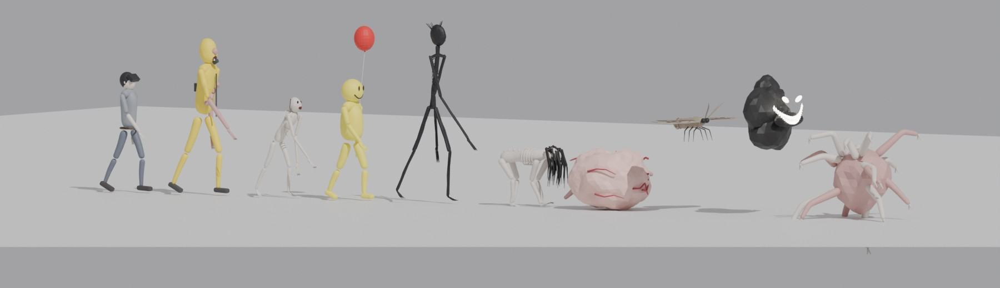
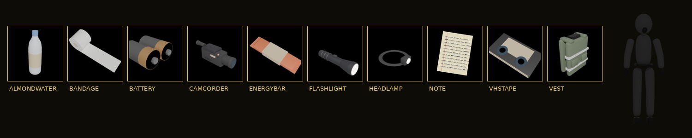
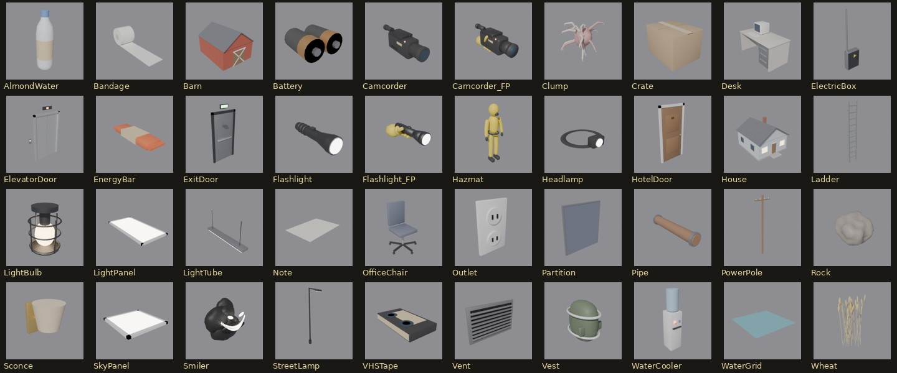

# THE BACKROOMS : Unreal Engine 5.8

> *« Si vous ne faites pas attention et que vous noclippez hors de la réalité au mauvais endroit,
> vous finirez dans les Backrooms… »*

Jeu d'exploration horrifique à la première personne, **100 % procédural et infini**, inspiré du
[Backrooms Wiki](https://backrooms-wiki.wikidot.com/normal-levels-i) (contenu sous licence CC BY-SA 3.0).
Il comprend le **Niveau 0** et **11 autres niveaux** du wiki, **9 entités**, et des modèles 3D générés par Blender.

**Nouveautés de la version 3.4** :
- **Conseil d'hébergement** affiché dès le menu principal et sur la page MULTIJOUEUR : c'est le joueur qui a
  **l'ordinateur le plus puissant** (et la meilleure connexion) qui devrait héberger, car son PC fait tourner le monde
  et les entités pour tout le groupe.
- **Chat vocal de proximité** : on entend ses coéquipiers depuis leur personnage. La voix faiblit avec la distance et
  est **étouffée derrière les murs**. Trois modes : appuyer pour parler (**T**, par défaut), voix ouverte, micro coupé.
  Des barres s'animent à côté du nom de celui qui parle.
- **À terre, pas mort** (coopération) : un coéquipier a 30 secondes pour vous **relever** en maintenant **E** près de
  vous (3,5 s). Vous gardez votre inventaire. Sinon, réveil au point de départ ; **Espace** pour abandonner tout de suite.
- **Hallucinations** : quand la santé mentale baisse, on aperçoit une **silhouette sans visage** au coin de l'œil,
  qui disparaît dès qu'on la regarde, ou un **sourire lumineux** qui flotte dans le noir. Seul le joueur concerné les voit.
- **Paramètres complets** (sur deux colonnes) : volume général, chat vocal, luminosité, mode d'affichage (plein écran,
  fenêtré sans bordure, fenêtré), résolution de rendu (TSR), synchro verticale, limite d'images par seconde,
  balancement de la caméra.
- **Pause en ligne** : liste des joueurs, l'hôte et la latence (ping) de chacun.

**Nouveautés de la version 3.3** :
- **Menu principal** au lancement : **SOLO** (choix du niveau de départ), **MULTIJOUEUR**, **PARAMÈTRES**, **QUITTER**.
  Il se pilote à la souris ou au clavier (**↑ / ↓**, **Entrée**, **Échap** pour revenir en arrière).
- **Multijoueur en coopération**, jusqu'à 4 joueurs : un joueur héberge, les autres le rejoignent avec son adresse IP.
  Tout le groupe partage les mêmes salles, les sorties, les coupures de courant, les entités et les objectifs du Niveau 0.
  On voit ses coéquipiers en combinaison, avec leur lampe, l'objet qu'ils tiennent et leur nom. Détails au § 2 ter.
- Menu pause : nouveau bouton **MENU PRINCIPAL** (quitter la partie sans fermer le jeu).

**Nouveautés de la version 3.2** :
- **Modèles 3D invisibles corrigés** (lampes du plafond, plan d'eau, objets…). Les FBX stockaient l'échelle (×100) et la
  rotation sur le nœud de l'objet. L'importeur d'Unreal 5.5+ (Interchange) peut l'ignorer, et les modèles arrivaient alors
  100 fois trop petits. Ils sont maintenant exportés « tout intégré » : géométrie en centimètres, aucune transformation.
  Au lancement, le jeu vérifie la taille des modèles et affiche un message si l'import est à refaire.
- **Niveau 0** : les néons apparaissent au plafond. La **Bacteria fait des rondes** autour de vous et passe régulièrement
  dans votre champ de vision. Elle met un instant à vous repérer (elle s'arrête et tourne la tête), plus vite si vous
  êtes près, si vous courez ou si vous l'éclairez. **Les lampes virent au rouge à moins de 10 m d'elle.**
  Des **Smilers surgissent du noir à chaque coupure de courant** et disparaissent au retour de la lumière.
- **Cachettes** : placards de bureau (on entre) et trous dans le mur (on s'y glisse accroupi). Caché, on n'est ni vu
  ni entendu par les entités (indication « CACHÉ » à l'écran).
- **Réglages** : « EFFET CAMÉSCOPE (VHS) » à désactiver pour un écran normal (sans viseur REC, cadres, lignes,
  aberration ni saleté d'objectif). « RENDU DE L'EAU » : Single Layer Water ou eau translucide (toujours visible).

**Nouveautés de la version 3** :
- **Interaction corrigée** : **E** ramasse vraiment les objets. La visée suit maintenant la rotation de la caméra
  (avant, elle restait à l'horizontale et ne touchait pas les objets posés au sol). Une petite tolérance aide aussi
  à viser un objet proche.
- **Toutes les touches se reconfigurent, même en pleine partie** : onglet **TOUCHES** de l'inventaire (**Tab**) ou
  bouton **TOUCHES** du menu pause. Chaque action accepte 3 touches (clavier ou boutons de souris). Les messages
  du jeu (« [E] Ramasser »…) affichent vos touches. Les réglages sont sauvegardés.
- **L'eau bouge** : houle lente qui soulève la surface, clapot qui déforme les reflets, et **ondes circulaires**
  qui partent du joueur à chaque pas, à chaque brasse, quand il saute ou plonge dans l'eau, et quand des gouttes
  tombent du plafond. Tout est calculé dans le matériau d'eau (nœud HLSL).
- **Poolrooms refaites d'après la capture de référence** : eau limpide turquoise-verte, petit carrelage blanc cassé
  très brillant, **plafonniers ovales**, **grandes verrières inclinées** qui inondent les salles de lumière du jour.
- **Bassins profonds** où l'on **nage** : nage dans la direction du regard, plongée, apnée (jauge d'oxygène),
  remontée, sortie par le rebord. L'eau freine la marche (démarrages et arrêts plus lents), la vue est teintée sous
  la surface (brouillard turquoise, son étouffé), des projecteurs sont immergés dans les bassins.
- **Nouveau papier peint du Niveau 0** (rayures jaune-vert à chevrons, d'après l'image fournie).
- **Modèles fournis intégrés** : la **combinaison hazmat** devient le corps du joueur (visible en **vue à la 3e personne**,
  touche **V**), la **Bacteria** et le **Deathmoth** utilisent les modèles fournis (articulés). Le Skin-Stealer se
  déguise avec la vraie combinaison.

**Nouveautés de la version 2** (inspirées de *Backrooms : Escape Together*) :
- **Inventaire (TAB)** façon Escape Together : objectifs, biométrie, poches, stockage, équipement sur une silhouette,
  glisser-déposer à la souris, inspection des objets, onglets Journal et Paramètres.
- **Caméscope** (REC, vision nocturne **N**), **coupures de courant**, **cassettes VHS** à retrouver dans le Niveau 0.
- **Entités refaites** : squelette articulé (bras, avant-bras, cuisses, tibias, tête qui vous suit du regard),
  nouvelle entité **Bacteria**, comportements proches du jeu (le Smiler charge si on l'éclaire, les Partygoers chassent
  pendant les coupures, le Skin-Stealer se fait passer pour un explorateur…).
- **Graphismes** : textures **normal maps** sur tous les murs, sols et plafonds, saleté au pied des murs, néons en
  **lumières surfaciques**, **ray tracing matériel (RTX)** via Lumen, **eau Single Layer Water** avec vagues, rides,
  absorption de la lumière et caustiques animées (Poolrooms), peau en *subsurface scattering*.



---

## 1. Installation (première fois)

**Prérequis**
- Unreal Engine **5.8** (installé via l'Epic Games Launcher)
- **Visual Studio 2022** avec la charge de travail « Développement de jeux en C++ » (le projet contient du code C++)
- *(facultatif)* Blender 4.x / 5.x, uniquement si vous voulez régénérer les modèles

**Étapes**
1. Copiez le dossier `Backrooms/` où vous voulez sur votre PC.
2. Double-cliquez sur **`Backrooms.uproject`**.
   Unreal demande de compiler le module « Backrooms » : répondez **Oui** (1 à 3 minutes).
   *(Si la compilation échoue : clic droit sur le `.uproject` → « Generate Visual Studio project files »,
   ouvrez `Backrooms.sln` et compilez la configuration `Development Editor`.)*
3. Au **premier** lancement de l'éditeur, le script `Content/Python/init_unreal.py` importe **automatiquement**
   toutes les ressources : 52 textures (dont 21 normal maps), 11 icônes, 66 sons, 95 modèles (FBX). Il crée aussi
   les matériaux (`M_BR_World`, `M_BR_Mesh`, `M_BR_Skin`, `M_BR_Water`) et la carte `/Game/Backrooms/Maps/L_Backrooms`.
   Une barre de progression s'affiche, puis un message « Import terminé ».
   **Si vous aviez déjà importé une version précédente**, le script le détecte (`Saved/BackroomsSetup.txt`) et réimporte tout automatiquement.
4. Appuyez sur **Play** (Alt+P). Dans le menu principal, choisissez **SOLO**, puis le niveau (← / →), puis **NOCLIPPER**
   (ou **Entrée**). Pour jouer à plusieurs : **MULTIJOUEUR** (voir § 2 ter).

> Pour relancer l'import à la main : *Window → Output Log*, choisir **Python** en bas, puis
> `import backrooms_setup; backrooms_setup.run(force=True)`
>
> **Mode secours** : si l'import n'a pas pu se faire, le jeu reste texturé dans l'éditeur. Il lit alors les textures
> directement dans `RawAssets/` (avec mipmaps) et construit les matériaux en C++ (`BRMaterialBuilder.cpp`).
> Le menu titre l'indique en jaune. Les sons, eux, nécessitent l'import.

---

## 2. Contrôles

Ce sont les touches **par défaut**. **Toutes** se changent à tout moment : **Tab → onglet TOUCHES** (ou **Pause → TOUCHES**).
Cliquez sur une case, appuyez sur la nouvelle touche. **Échap** annule, **Retour arrière** vide la case, **clic droit**
efface une case, **PAR DÉFAUT** rétablit tout. Une touche déjà utilisée par une autre action lui est retirée (un message l'indique).

| Action | Clavier / souris | Manette |
|---|---|---|
| Se déplacer | **ZQSD** ou **WASD** (les deux dispositions marchent) | Stick gauche |
| Regarder | Souris | Stick droit |
| Courir | **Maj** (consomme l'endurance) | Clic stick gauche |
| S'accroupir / **plonger** (dans l'eau profonde) | **Ctrl** ou **C** | B / Rond |
| Sauter / **remonter à la surface** / se hisser hors de l'eau | **Espace** | A / Croix |
| Lampe torche (main, ceinture ou frontale) | **F** | Y / Triangle |
| Vision nocturne (caméscope en main) | **N** | Croix haut |
| Interagir / ramasser / lire | **E** | X / Carré |
| Utiliser la poche 1 à 4 | **1 2 3 4** (AZERTY : **& é " '**) | |
| Boire de l'eau d'amande | **B** | LB / L1 |
| Mettre un bandage | **H** | Croix bas |
| Changer les piles | **R** | RB / R1 |
| **Inventaire** (objectifs, objets, journal, paramètres) | **Tab** ou **I** | Select |
| **Vue à la 1re / 3e personne** | **V** | Clic stick droit |
| Pause (REPRENDRE, PARAMÈTRES, TOUCHES, MENU PRINCIPAL, QUITTER) | **P** ou **Échap** (dans l'éditeur, Échap arrête le PIE : utilisez **P**) | Start |
| Se cacher | Entrer dans un placard, ou **s'accroupir** dans un trou du mur | |
| **Parler** (chat vocal, mode « appuyer pour parler ») | **T** | |
| **Relever un coéquipier à terre** | **E** maintenu près de lui | X / Carré |
| Quitter (menu / pause) | **Fin** | |

**Dans l'inventaire** : **glisser-déposer** pour déplacer un objet (poches ↔ stockage ↔ équipement),
**double-clic** pour l'utiliser / l'équiper / le retirer, **clic droit** pour l'inspecter.

**Commandes console** (touche `²` ou `` ` ``) :
`BRLevel 37` (aller à un niveau) · `BRGod` (invincible) · `BRSpawn 0..8` (faire apparaître une entité ; 8 = Bacteria) ·
`BRGiveAll` (remplit l'inventaire) · `BRBlackout` (coupure de courant) · `BRObjectives` (valide les objectifs) ·
`BRSensitivity 1.5` · `BRInvertY`.
Ligne de commande : `-BRLevel=3` pour démarrer directement sur un niveau.

---

## 2 bis. L'inventaire (TAB)



L'écran reprend la disposition d'*Escape Together*, avec quelques différences :
- en-tête **MENU >** et onglets **PERSONNAGE**, **JOURNAL**, **PARAMÈTRES**, **TOUCHES** ;
- colonne de gauche : **OBJECTIFS** (ex. « FILMER PENDANT UNE COUPURE 0/1 », « TROUVER LES CASSETTES VHS 1/6 ») et
  **BIOMÉTRIE** (santé mentale, santé, endurance, piles) avec des flèches de tendance ;
- au centre : **POCHES** (4 cases, raccourcis 1 à 4) et **STOCKAGE** (20 cases) ;
- à droite : **ÉQUIPEMENT** sur la silhouette en combinaison : TÊTE (frontale), TORSE (gilet), MAIN (caméscope ou lampe),
  CEINTURE (lampe) ;
- pied de page « © 1992 THRESHOLD SYSTEMS », fond sombre teinté de jaune avec lignes de balayage.

Le monde **continue de tourner** quand l'inventaire est ouvert : comme dans le jeu, mieux vaut le faire à l'abri.

| Objet | Effet |
|---|---|
| Eau d'amande | +40 santé mentale, +10 santé |
| Bandages | +35 santé |
| Piles | recharge la lampe et le caméscope |
| Barre énergétique | endurance au maximum et récupération doublée pendant 30 s |
| Cassette VHS | objectif du Niveau 0 |
| Lampe torche | main ou ceinture, **F** |
| Lampe frontale | tête : éclaire en gardant les mains libres |
| Gilet de protection | torse : −30 % de dégâts |
| Caméscope | main : REC, vision nocturne (**N**), tâches d'enregistrement |

L'onglet **PARAMÈTRES** règle la sensibilité, l'axe Y, le champ de vision, la qualité graphique, le **ray tracing matériel
(RTX)**, les reflets ray tracés haute qualité, les néons surfaciques, le brouillard volumétrique et le grain.
Les réglages et les touches sont sauvegardés dans `Saved/Config/<plateforme>/GameUserSettings.ini`
(section `[/Script/Backrooms.BRKeys]` pour les touches).

---

## 2 ter. Multijoueur (coopération, jusqu'à 4 joueurs)

**Héberger** : menu principal → **MULTIJOUEUR** → choisir le niveau de départ (← / →) → **HÉBERGER UNE PARTIE**.
La carte se recharge en mode serveur et vous êtes directement en jeu. Votre adresse IP est affichée sur la page
MULTIJOUEUR : donnez-la à vos amis. Au premier lancement, Windows peut demander d'autoriser le jeu dans le pare-feu :
acceptez (au moins pour les réseaux privés).

**Rejoindre** : **MULTIJOUEUR** → **REJOINDRE UNE PARTIE** → tapez l'adresse IP de l'hôte → **Entrée** (ou **SE CONNECTER**).
La dernière adresse utilisée est mémorisée. Si la connexion échoue, un message s'affiche au bout de 20 secondes.

**Quelle adresse ?**
- **Même réseau** (même box ou même Wi-Fi) : l'adresse locale affichée (192.168.x.x) suffit.
- **Par Internet** : l'hôte redirige le port **7777 en UDP** vers son PC dans l'interface de sa box, puis donne son adresse
  IP publique. Plus simple : un réseau virtuel (**Radmin VPN**, **ZeroTier**, **Tailscale**…). Tout le monde le rejoint et
  utilise l'adresse IP de ce réseau.
- Tout le monde doit utiliser **la même version du jeu** (la même compilation).

**Ce qui est partagé par le groupe** :
- le niveau et ses salles (même graine de génération) ; quand un joueur prend une sortie, **tout le groupe change de niveau** ;
- les coupures de courant et les lampes rouges du Niveau 0 ;
- les entités : l'hôte les simule, et elles traquent le joueur vivant le plus proche (un joueur caché est délaissé) ;
- les objectifs du Niveau 0 : les cassettes VHS et les enregistrements de chacun comptent pour tous. Un objet ramassé
  disparaît chez tout le monde.

Vous voyez vos coéquipiers en combinaison hazmat (lampe allumée, objet en main, nage), leur nom et leur distance
au-dessus de leur tête, et vous entendez leurs pas.

**Qui héberge ?** Celui qui a **l'ordinateur le plus puissant** et la meilleure connexion : son PC fait tourner le
monde, les entités et leurs déplacements pour tout le groupe, en plus de son propre affichage.

**Chat vocal de proximité** : on entend chaque coéquipier depuis son personnage. Sa voix faiblit avec la distance
(on ne l'entend plus au-delà de 25 m environ) et elle est étouffée derrière les murs. Le mode se choisit dans
**Paramètres → CHAT VOCAL** : **appuyer pour parler** (touche **T**, par défaut), **voix ouverte** ou **micro coupé**.
L'indicateur en bas à gauche montre quand votre micro transmet. **Chacun garde** son inventaire, sa santé, sa santé mentale, son
endurance et son journal.

**À terre** : en coopération, on ne meurt pas tout de suite. Un coéquipier peut vous **relever** en maintenant **E**
près de vous pendant 3,5 secondes : vous repartez avec un peu de santé et **tout votre inventaire**. Si personne ne
vient dans les 30 secondes (ou s'il ne reste personne debout), vous vous réveillez au point de départ du niveau avec
l'équipement de départ. **Espace** permet d'abandonner tout de suite. Si le groupe change de niveau, vous le suivez.

**Pause** : en ligne, le jeu ne s'arrête pas pendant la pause. **MENU PRINCIPAL** quitte la partie. Si c'est l'hôte qui
quitte, la partie se termine pour tout le monde.

**Commandes console** : `BRLevel`, `BRBlackout`, `BRObjectives` et `BRSpawn` sont exécutées par l'hôte, même tapées par un client.

**Tester seul dans l'éditeur** : flèche à côté de **Play** → *Number of Players* : **2** et *Net Mode* : **Play As Listen Server**.
Les deux fenêtres arrivent directement en partie, sans passer par le menu.

---

## 3. Mécaniques de survie

- **Santé** : les entités vous blessent. Elle remonte lentement si vous êtes au calme.
- **Santé mentale** : elle baisse avec le temps, dans le noir, près des entités et pendant les poursuites.
  En dessous de 30 % surviennent vertiges, aberrations chromatiques, murmures et faux bruits de pas.
  Sous 50 %, les **hallucinations** commencent : une silhouette sans visage au coin de l'œil (elle disparaît dès
  qu'on la regarde), un sourire qui flotte dans le noir… En multijoueur, vous êtes seul à les voir.
  À 0, la folie vous tue. **L'eau d'amande** rend +40 de santé mentale.
- **Endurance** : courir fait du bruit, et le bruit attire les entités.
- **Lampe torche** : les piles se vident en 4 minutes environ et la lampe vacille quand elles sont faibles.
  La lumière attire les Deathmoths et fait charger les Smilers.
- **Caméscope** : tenu en main, il affiche le viseur REC et permet la **vision nocturne** (**N**, consomme les piles).
  Filmer une entité pendant 3 secondes l'ajoute au journal.
- **Coupures de courant** (Niveaux 0, 1, 2, 3, 5) : les néons vacillent puis s'éteignent pendant 25 à 40 secondes.
  Les entités en profitent (Partygoers en chasse, Smilers plus nombreux).
- **Objectifs du Niveau 0** : comme dans Escape Together, les sorties restent **instables** tant que vous n'avez pas
  retrouvé **6 cassettes VHS** (elles luisent faiblement) et **filmé pendant une coupure** (5 secondes, caméscope en main).
- **Sorties** : chaque niveau contient des passages vers d'autres niveaux (mur qui « glitche », porte de secours,
  ascenseur, échelle, grange…). Ils émettent un **bourdonnement électrique** : écoutez-le pour les trouver.
- **Notes** : des vagabonds ont laissé des notes, avec des indices et les règles de survie.
- **Eau** (Niveau 37) : l'eau ralentit la marche (jusqu'à −40 % quand elle arrive à la taille). Dans les **bassins
  profonds** (2,6 m sous le carrelage), on **nage** : on avance dans la direction du regard (regarder vers le bas pour
  descendre), **Espace** pour remonter, **Ctrl/C** pour plonger, **Maj** pour nager vite (fatigant). Sous l'eau, la
  jauge **OXYGÈNE** se vide en 18 s environ ; ensuite on se noie. Pour sortir, nagez contre un rebord sans mur au-dessus
  et appuyez sur **Espace** (ou continuez d'avancer) : le personnage se hisse sur le bord.
- **Cachettes** (Niveau 0) : placards et trous dans le mur. Une fois caché, les entités perdent votre trace (sauf si
  elles vous ont vu y entrer juste devant elles). Idéal pendant les coupures, quand les Smilers rôdent.
- **Mort** : vous vous réveillez au Niveau 0 avec l'équipement de départ (caméscope, lampe, eau, bandage, piles).

L'écran imite une caméra « found footage » : REC, horodatage, grain et vignettage.

---

## 4. Les niveaux

| N° | Titre (wiki) | Ambiance dans le jeu | Entités | Sorties |
|---|---|---|---|---|
| **0** | *Threshold* (« The Lobby ») | Salles jaunes à l'infini, papier peint en relief, moquette humide, prises et aérations, néons qui bourdonnent, clignotent, sautent lors des coupures et **rougissent près de la Bacteria**. Placards et trous dans le mur pour se cacher | Bacteria (fait des rondes), Smilers (dans le noir et à chaque coupure) | Mur qui glitche → 1, sol qui glitche → 37 (rare). **Objectifs requis** : 6 cassettes VHS + filmer une coupure |
| **1** | *Habitable Zone* | Entrepôt de béton brumeux, piliers, flaques, caisses | Smilers, Facelings, Hounds | Porte de secours → 2, ascenseur → 4 |
| **2** | *Abandoned Utility Halls* (« Pipe Dreams ») | Labyrinthe de couloirs étroits, tuyaux, ampoules orange | Wretches, Hounds, Clump, Smilers | Porte → 3, échelle → 1 |
| **3** | *Electrical Station* | Briques, grilles métalliques, armoires électriques, vacarme de machines | Hounds, Skin-Stealers, Smilers, Deathmoths, Wretches | Ascenseur → 4, porte → 2 |
| **4** | *Abandoned Office* | Open-space éclairé, bureaux, fontaines, beaucoup d'eau d'amande | Facelings, Partygoer (rare) | Porte → 5, ascenseur → 1 |
| **5** | *Terror Hotel* | Couloirs d'hôtel des années 1920, moquette rouge, appliques, portes numérotées | Skin-Stealers, Partygoers, Facelings | Porte « chaufferie » → 6 |
| **6** | *Lights Out* | Obscurité totale : seule votre lampe éclaire | Smilers (nombreux) | Échelle → 8 |
| **8** | *Cave System* | Grottes rocheuses, vieilles lampes de mine | Deathmoths, Clump, Hounds | Échelle → 9 |
| **9** | *The Suburbs* | Banlieue infinie la nuit, maisons, lampadaires au sodium | Skin-Stealers, Hounds, Facelings | Porte de maison entrouverte → 10 |
| **10** | *Field of Wheat* | Champ de blé infini sous un ciel couvert, granges, poteaux | Faceling (paisible) | Grange → 11 |
| **11** | *The Endless City* | Ville infinie de gratte-ciel, en plein jour | Facelings (paisibles) | Porte d'immeuble → niveau aléatoire |
| **37** | *Sublimity* (« Poolrooms ») | Salles en petit carrelage blanc brillant, plafonniers ovales et grandes verrières inclinées, inondées d'une eau tiède turquoise-verte qui ondule (houle, clapot, ondes autour du joueur, réfraction, caustiques). **Bassins profonds** où l'on nage, éclairés par des projecteurs immergés | aucune | Sol qui glitche → 0, échelle → 4 |

Chaque niveau est une grille **infinie** générée par hachage déterministe à partir d'une graine. Elle est chargée par morceaux de 8×8 cellules (« chunks ») autour du joueur, et chaque visite produit une nouvelle disposition.
Algorithmes : salles aléatoires (0, 1, 4, 6, 37), labyrinthe (2, 3), couloirs d'hôtel (5), grottes (8),
quartier pavillonnaire (9), espace ouvert (10), îlots urbains (11).

---

## 5. Les entités

| Entité | N° wiki | Comportement dans le jeu | Comment survivre |
|---|---|---|---|
| **Bacteria** | (Niveau 0) | *(modèle fourni)* Silhouette démesurée en fils torsadés, aux gestes saccadés. Erre, vous traque dès qu'elle vous voit ou vous entend, puis fouille votre dernière position | Casser la ligne de vue : portes, virages. Ne pas courir vers elle |
| **Smilers** | 3 | Flottent dans le noir et approchent quand on ne les regarde pas. **Chargent** dès qu'on les éclaire plus d'une fraction de seconde | Éteindre la lampe, reculer lentement. Une zone bien éclairée les dissipe. |
| **Deathmoths** | 4 | *(modèle fourni : phalène scannée)* Papillons géants volants, attirés par la lampe torche, piqûre toxique | Éteindre la lampe |
| **Clump** | 5 | Masse de membres qui roule vers vous | Le semer dans les couloirs |
| **Hounds** | 8 | Rôdent à quatre pattes, sentent la peur et chargent si vous courez ou leur tournez le dos | Les regarder en face et reculer en marchant : ils finissent par fuir |
| **Facelings** | 9 | Humains sans visage, surtout passifs. 15 % sont des adultes agressifs. Dans le champ de blé (Niveau 10), certains se tapissent dans les blés et vous attrapent | Garder ses distances |
| **Skin-Stealers** | 10 | Masse de chair au repos ; à votre approche, se transforme en « explorateur en combinaison » (la même combinaison hazmat que la vôtre) qui marche vers vous, puis se révèle et charge | Se méfier des silhouettes en combinaison. Fuir et casser la ligne de vue |
| **Wretches** | 15 | Vagabonds dégénérés, lents mais tenaces | Ne pas se laisser acculer |
| **Partygoers** | 67 | =) Restent immobiles en souriant, un ballon rouge à la main. Partent en chasse si vous soutenez leur regard plus de 3 s, ou pendant une coupure | Détourner le regard, se cacher pendant les coupures |

Les humanoïdes ont un **squelette articulé** (torse, tête, bras, avant-bras, cuisses, tibias) animé de façon procédurale
en C++ : marche avec flexion des genoux, bras tendus pendant les poursuites, tête qui suit le joueur, spasmes de la Bacteria.
Les Hounds marchent à quatre pattes (pattes en deux segments).
Les entités se déplacent grâce à un **A\*** sur la grille du niveau, sans NavMesh.
Le journal (**Tab**) enregistre chaque entité rencontrée, avec sa fiche et un conseil.

---

## 6. Structure du projet

```
Backrooms/
├── Backrooms.uproject           Projet UE 5.8 (plugins : EnhancedInput, PythonScriptPlugin, EditorScriptingUtilities)
├── Config/                      Lumen, ombres virtuelles, mode de jeu par défaut, Enhanced Input
├── Source/Backrooms/
│   ├── BRTypes.h                Structures des niveaux, hachage déterministe
│   ├── BRLevels.cpp             ★ Définition des 12 niveaux (tout est réglable ici)
│   ├── BRWorld.*                Grille infinie, streaming, A*, ambiance, transitions, entités, état partagé en réseau
│   ├── BRChunk.*                Construction d'un chunk : murs, portes, néons, accessoires, bassins (instances)
│   ├── BREntity.*               Les 9 entités : fiches, IA, squelette articulé, animation procédurale
│   ├── BRCharacter.*            Joueur : inventaire, équipement, caméscope, lampe, endurance, santé mentale,
│   │                            nage / apnée, corps en combinaison et vue à la 3e personne
│   ├── BRKeys.*                 Touches configurables (3 par action), sauvegarde, libellés « [E] »
│   ├── BRRig.*                  Humanoïdes articulés (entités et corps du joueur)
│   ├── BRItems.*                Catalogue des objets (nom, icône, effet, emplacement)
│   ├── BRPlayerController.*     Entrées (Enhanced Input en C++), menu principal, multijoueur, inventaire, paramètres, console
│   ├── BRHUD.*                  Interface (Canvas) : menu, REC, inventaire TAB façon Escape Together
│   ├── BRInteractables.*        Objets à ramasser et sorties de niveau (verrouillées par les objectifs)
│   ├── BRAssets.*               Chargement des ressources + matériaux + secours (textures lues dans RawAssets)
│   └── BRMaterialBuilder.*      Construction des matériaux maîtres en C++ (éditeur) si l'import Python manque
├── Content/Python/
│   ├── init_unreal.py           Lancé automatiquement par l'éditeur
│   └── backrooms_setup.py       Import des textures, icônes, sons, FBX + création des matériaux et de la carte
├── RawAssets/                   Ressources sources (déjà générées)
│   ├── Textures/ (+ normal maps *_N)  Icons/  Sounds/  Meshes/ (FBX)  Previews/ (rendus des modèles)
├── Tools/
│   ├── Blender/generate_models.py    ★ Modélisation procédurale des 78 modèles + icônes d'inventaire (Blender)
│   ├── Blender/preview_entities.py   Rendu d'aperçu des entités assemblées
│   ├── Blender/import_user_models.py Découpe des modèles fournis (hazmat, Bacteria, Deathmoth) en pièces articulées
│   ├── SourceModels/                 (non versionné) Les fichiers d'origine des modèles fournis
│   ├── generate_textures.py          Textures procédurales « tileables » (numpy + Pillow)
│   └── generate_sounds.py            Synthèse de tous les sons (numpy)
└── Docs/                        Images d'aperçu
```

### Régénérer les ressources
```bash
# Modèles 3D (avec votre Blender installé)
blender -b -P Tools/Blender/generate_models.py              # tous les modèles
blender -b -P Tools/Blender/generate_models.py -- SM_Smiler # un seul
# Textures et sons (Python 3 + numpy + pillow)
python Tools/generate_textures.py
python Tools/generate_sounds.py
# Modèles fournis (placer asyc_hazmat.glb, bacteria_recreation.blend, « peppered moth.obj » et sa texture
# dans Tools/SourceModels/)
blender -b -P Tools/Blender/import_user_models.py
```
Ensuite, dans Unreal : `import backrooms_setup; backrooms_setup.run(force=True)`.




### Ajouter ou modifier un niveau
Tout se passe dans `Source/Backrooms/Private/BRLevels.cpp`. Chaque niveau est une fonction `LevelX()` qui règle
la grille (taille des cellules, densité des murs…), les surfaces (texture, teinte, échelle), l'éclairage
(type de néon, densité, clignotement, zones mortes), l'atmosphère (brouillard, ciel, exposition), le son,
les entités, les objets et les sorties. Ajoutez votre fonction à `BuildAll()`, et le niveau apparaît dans le menu.

---

## 7. Graphismes, RTX et performance

- Éclairage entièrement dynamique : **Lumen** (GI + reflets) et **Virtual Shadow Maps**.
- **RTX** : `r.RayTracing` et `r.Lumen.HardwareRayTracing` sont activés dans `Config/DefaultEngine.ini` (DirectX 12, SM6).
  Sur une carte compatible (GeForce RTX, Radeon RX 6000+), Lumen utilise le ray tracing matériel ; sinon il revient
  automatiquement au mode logiciel. L'option « Reflets ray tracés haute qualité » active le *hit lighting* (très coûteux).
  *Le changement de `r.RayTracing` demande un redémarrage de l'éditeur (recompilation des shaders, plusieurs minutes la première fois).*
- **Murs** : projection triplanaire dans l'espace monde (aucune texture étirée), **normal maps** (relief du papier peint,
  de la moquette, des joints), saleté à grande échelle, saleté au pied des murs, rugosité variable.
- **Néons** : lumières **surfaciques** (rect lights) pour des ombres douces ; seule une partie projette des ombres (`ShadowChance`).
- **Eau** (Poolrooms) : modèle *Single Layer Water* (absorption/diffusion de la lumière, reflets Lumen/RT). Un nœud HLSL
  calcule la houle (*World Position Offset* sur une grille subdivisée), le clapot et jusqu'à 8 ondes circulaires
  (paramètres `Ripple0..7` mis à jour par `ABRWorld::UpdateRipples`). S'y ajoutent des rides en normal maps qui
  défilent et des caustiques animées au fond. Réglages par niveau dans `BRLevels.cpp` : `WaterAbsorption`,
  `WaterScattering` (limpidité), `WaterWaves` (houle), `WaterChop` (clapot).
- Sur une petite configuration : onglet **PARAMÈTRES** (qualité « MOYEN », RTX désactivé, néons surfaciques désactivés),
  ou baissez `ViewDistance` / `LightChance` dans `BRLevels.cpp`.

## 8. Dépannage

| Problème | Solution |
|---|---|
| « Missing modules / Could not be compiled » | Installer Visual Studio 2022 + « Développement de jeux en C++ », puis recompiler via le `.sln` |
| Murs sans texture / tout est gris | Corrigé en v2 : les matériaux sont marqués « Used with Instanced Static Meshes » (sans ce drapeau, Unreal affichait le matériau par défaut) et le jeu se replie sur les textures de `RawAssets/`. Pour un résultat optimal, relancer `backrooms_setup.run(force=True)` depuis l'Output Log Python |
| Les murs apparaissent gris quelques secondes | Mode secours : Unreal compile les matériaux à la volée la première fois |
| L'eau est opaque / noire | Vérifier `r.Water.SingleLayer=1` et DirectX 12 ; relancer l'import |
| Sons absents | Vérifier que `/Game/Backrooms/Sounds` existe. Relancer l'import |
| Écran noir au lancement | C'est le fondu d'entrée ; dans le Niveau 6, c'est normal (**F** pour la lampe) |
| La souris ne tourne pas la caméra | Cliquer dans la fenêtre de jeu (capture de la souris). La caméra est bloquée tant que l'inventaire (TAB) est ouvert |
| Les touches 1 à 4 ne marchent pas | En AZERTY, les touches **& é " '** sont aussi reconnues ; sinon utiliser le pavé numérique |
| Trop sombre / trop clair | Ajuster `MinEV` / `MaxEV` / `ExposureBias` du niveau dans `BRLevels.cpp` |
| Pas de lampes au plafond, pas d'eau, objets invisibles | Corrigé en v3.2 (échelle des FBX). Laissez l'import se relancer au démarrage de l'éditeur (v5). Si un message rouge parle d'échelle : `import backrooms_setup; backrooms_setup.run(force=True)` |
| L'eau n'apparaît toujours pas | **Tab → PARAMÈTRES → RENDU DE L'EAU : TRANSLUCIDE** |
| Je veux l'écran sans l'effet caméscope | **Tab → PARAMÈTRES → EFFET CAMÉSCOPE (VHS) : DÉSACTIVÉ** |
| **E** ne ramasse rien | Corrigé en v3. Visez l'objet (le point au centre grossit et « [E] Ramasser » s'affiche). Si vous avez changé la touche, le message affiche la nouvelle |
| Une action ne répond plus | Une touche a pu lui être retirée en la donnant à une autre action : **Tab → TOUCHES**, ou **PAR DÉFAUT** |
| « Impossible de rejoindre la partie » | L'hôte doit avoir cliqué sur **HÉBERGER UNE PARTIE**. Vérifiez l'adresse, la redirection du port **7777 UDP** sur la box de l'hôte et son pare-feu Windows. Sinon, passez par Radmin VPN, ZeroTier ou Tailscale |
| On n'entend pas les autres | Vérifiez **Paramètres → CHAT VOCAL**. En « appuyer pour parler », il faut maintenir **T**. Vérifiez aussi l'accès au micro dans Windows (*Paramètres → Confidentialité → Microphone*) et le micro par défaut. Dans l'éditeur (PIE), le chat vocal peut ne pas fonctionner : testez en *Standalone Game* ou avec le jeu empaqueté, sur deux PC |
| « Connexion perdue avec l'hôte » | L'hôte a quitté la partie, ou la connexion a coupé : rejoignez à nouveau |
| Un ami ne voit pas les mêmes salles | Vous n'avez pas la même version du jeu : utilisez tous la même compilation |
| La combinaison n'apparaît pas en 3e personne | Le jeu affiche des boîtes jaunes si les modèles `SM_Hazmat_*` ne sont pas importés : relancer l'import |

---

*Les textes des niveaux et des entités sont des résumés en français librement inspirés du
[Backrooms Wiki](https://backrooms-wiki.wikidot.com) (CC BY-SA 3.0). Le code, les textures, les sons et la plupart
des modèles de ce dossier sont générés par les scripts fournis. **Exceptions** : la combinaison hazmat
(`asyc_hazmat`), la Bacteria (`bacteria-lifeform-backrooms`) et le Deathmoth (`deathmoth-backrooms`, phalène poivrée
scannée) viennent de modèles fournis par l'utilisateur. Ils ont été découpés et adaptés par
`Tools/Blender/import_user_models.py`. Vérifiez leur licence d'origine avant toute diffusion publique du jeu.*
