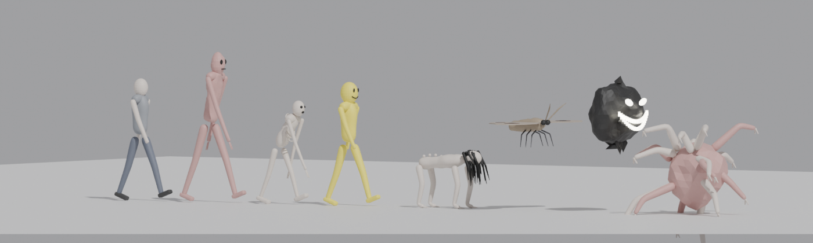
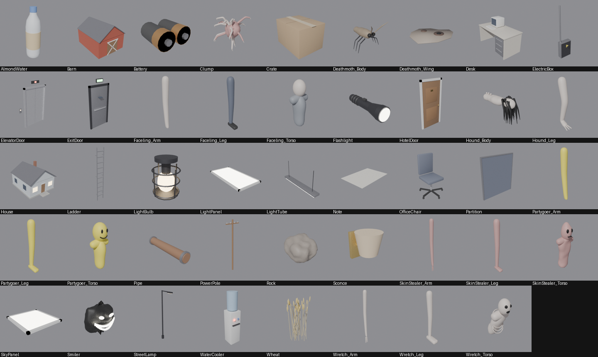
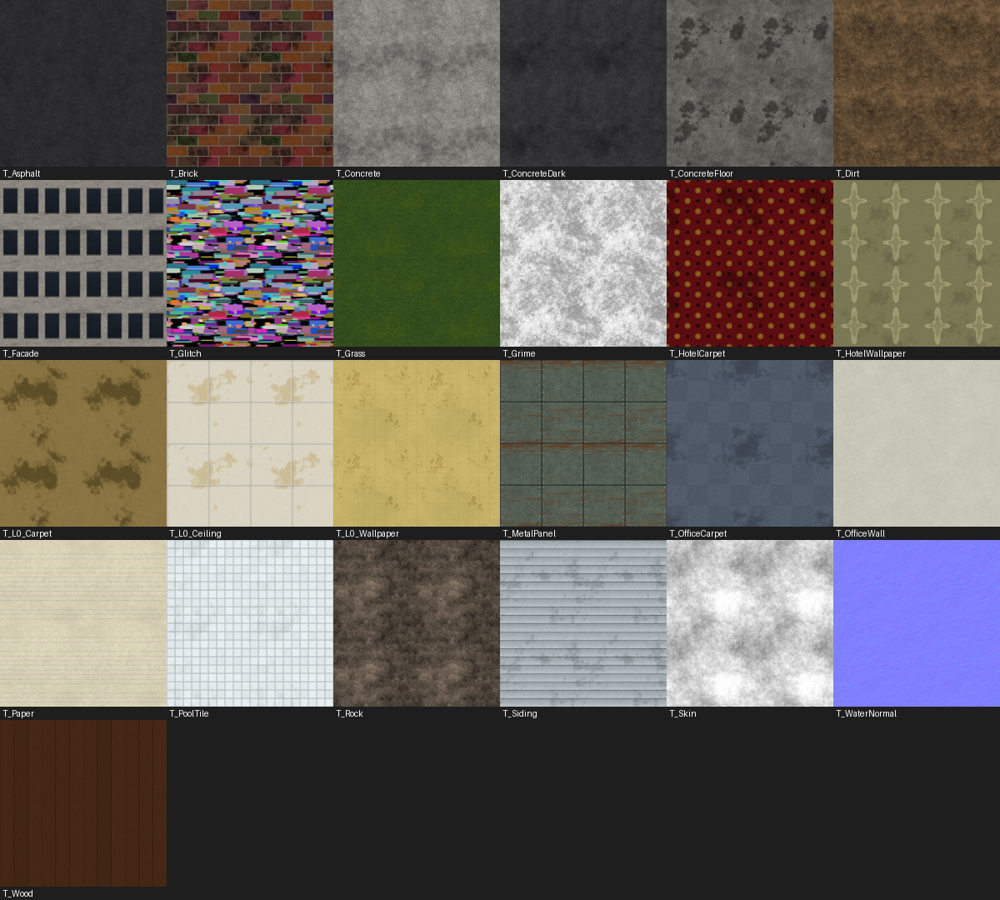

# THE BACKROOMS : Unreal Engine 5.8

> *« Si vous ne faites pas attention et que vous noclippez hors de la réalité au mauvais endroit,
> vous finirez dans les Backrooms… »*

Jeu d'exploration horrifique à la première personne, **100 % procédural et infini**, inspiré du
[Backrooms Wiki](https://backrooms-wiki.wikidot.com/normal-levels-i) (contenu sous licence CC BY-SA 3.0).
Il comprend le **Niveau 0** et **11 autres niveaux** du wiki, **8 entités**, et des modèles 3D générés par Blender.



---

## 1. Installation (première fois)

**Prérequis**
- Unreal Engine **5.8** (installé via l'Epic Games Launcher)
- **Visual Studio 2022** avec la charge de travail « Développement de jeux en C++ » (le projet contient du code C++)
- *(facultatif)* Blender 4.x / 5.x, uniquement si vous voulez régénérer les modèles

**Étapes**
1. Copiez le dossier `Backrooms/` où vous voulez sur votre PC.
2. Double-cliquez sur **`Backrooms.uproject`**.
   Unreal demande de compiler le module « Backrooms » : répondez **Oui** (1 à 3 minutes).
   *(Si la compilation échoue : clic droit sur le `.uproject` → « Generate Visual Studio project files »,
   ouvrez `Backrooms.sln` et compilez la configuration `Development Editor`.)*
3. Au **premier** lancement de l'éditeur, le script `Content/Python/init_unreal.py` importe **automatiquement**
   toutes les ressources : 25 textures, 52 sons, 44 modèles Blender. Il crée aussi les matériaux et la carte
   `/Game/Backrooms/Maps/L_Backrooms`. Une barre de progression s'affiche, puis un message « Import terminé ».
4. Appuyez sur **Play** (Alt+P). Dans le menu titre, choisissez le niveau (← / →) puis appuyez sur **Entrée** pour « noclipper ».

> Pour relancer l'import à la main : *Window → Output Log*, choisir **Python** en bas, puis
> `import backrooms_setup; backrooms_setup.run(force=True)`
>
> Même sans import, le jeu fonctionne : il utilise alors des formes et couleurs de secours.

---

## 2. Contrôles

| Action | Clavier / souris | Manette |
|---|---|---|
| Se déplacer | **ZQSD** ou **WASD** (les deux dispositions marchent) | Stick gauche |
| Regarder | Souris | Stick droit |
| Courir | **Maj** (consomme l'endurance) | Clic stick gauche |
| S'accroupir | **Ctrl** ou **C** | B / Rond |
| Sauter | **Espace** | A / Croix |
| Lampe torche | **F** | Y / Triangle |
| Interagir / ramasser / lire | **E** | X / Carré |
| Boire de l'eau d'amande | **B** | LB / L1 |
| Changer les piles | **R** | RB / R1 |
| Journal (niveau, entités vues) | **Tab** (maintenir) | Select |
| Pause | **P** (Échap arrête le PIE dans l'éditeur) | Start |
| Quitter (menu / pause) | **Fin** | |

**Commandes console** (touche `²` ou `` ` ``) :
`BRLevel 37` (aller à un niveau) · `BRGod` (invincible) · `BRSpawn 0..7` (faire apparaître une entité) ·
`BRGiveAll` (eau + piles) · `BRSensitivity 1.5` · `BRInvertY`.
Ligne de commande : `-BRLevel=3` pour démarrer directement sur un niveau.

---

## 3. Mécaniques de survie

- **Santé** : les entités vous blessent. Elle remonte lentement si vous êtes au calme.
- **Santé mentale** : elle baisse avec le temps, dans le noir, près des entités et pendant les poursuites.
  En dessous de 30 % surviennent vertiges, aberrations chromatiques, murmures et faux bruits de pas.
  À 0, la folie vous tue. **L'eau d'amande** rend +40 de santé mentale.
- **Endurance** : courir fait du bruit, et le bruit attire les entités.
- **Lampe torche** : les piles se vident en 4 minutes environ et la lampe vacille quand elles sont faibles.
  La lumière attire les Deathmoths et énerve les Smilers.
- **Sorties** : chaque niveau contient des passages vers d'autres niveaux (mur qui « glitche », porte de secours,
  ascenseur, échelle, grange…). Ils émettent un **bourdonnement électrique** : écoutez-le pour les trouver.
- **Notes** : des vagabonds ont laissé des notes, avec des indices et les règles de survie.
- **Mort** : vous vous réveillez au Niveau 0, sans votre inventaire.

L'écran imite une caméra « found footage » : REC, horodatage, grain et vignettage.

---

## 4. Les niveaux

| N° | Titre (wiki) | Ambiance dans le jeu | Entités | Sorties |
|---|---|---|---|---|
| **0** | *Threshold* (« The Lobby ») | Salles jaunes à l'infini, moquette humide, néons qui bourdonnent et clignotent, zones mortes dans le noir | Smiler (très rare, dans le noir) | Mur qui glitche → 1, sol qui glitche → 37 (rare) |
| **1** | *Habitable Zone* | Entrepôt de béton brumeux, piliers, flaques, caisses | Smilers, Facelings, Hounds | Porte de secours → 2, ascenseur → 4 |
| **2** | *Abandoned Utility Halls* (« Pipe Dreams ») | Labyrinthe de couloirs étroits, tuyaux, ampoules orange | Wretches, Hounds, Clump, Smilers | Porte → 3, échelle → 1 |
| **3** | *Electrical Station* | Briques, grilles métalliques, armoires électriques, vacarme de machines | Hounds, Skin-Stealers, Smilers, Deathmoths, Wretches | Ascenseur → 4, porte → 2 |
| **4** | *Abandoned Office* | Open-space éclairé, bureaux, fontaines, beaucoup d'eau d'amande | Facelings, Partygoer (rare) | Porte → 5, ascenseur → 1 |
| **5** | *Terror Hotel* | Couloirs d'hôtel des années 1920, moquette rouge, appliques, portes numérotées | Skin-Stealers, Partygoers, Facelings | Porte « chaufferie » → 6 |
| **6** | *Lights Out* | Obscurité totale : seule votre lampe éclaire | Smilers (nombreux) | Échelle → 8 |
| **8** | *Cave System* | Grottes rocheuses, vieilles lampes de mine | Deathmoths, Clump, Hounds | Échelle → 9 |
| **9** | *The Suburbs* | Banlieue infinie la nuit, maisons, lampadaires au sodium | Skin-Stealers, Hounds, Facelings | Porte de maison entrouverte → 10 |
| **10** | *Field of Wheat* | Champ de blé infini sous un ciel couvert, granges, poteaux | Faceling (paisible) | Grange → 11 |
| **11** | *The Endless City* | Ville infinie de gratte-ciel, en plein jour | Facelings (paisibles) | Porte d'immeuble → niveau aléatoire |
| **37** | *Sublimity* (« Poolrooms ») | Salles carrelées blanches inondées d'eau tiède, lumière douce | aucune | Sol qui glitche → 0, échelle → 4 |

Chaque niveau est une grille **infinie** générée par hachage déterministe à partir d'une graine. Elle est chargée par morceaux de 8×8 cellules (« chunks ») autour du joueur, et chaque visite produit une nouvelle disposition.
Algorithmes : salles aléatoires (0, 1, 4, 6, 37), labyrinthe (2, 3), couloirs d'hôtel (5), grottes (8),
quartier pavillonnaire (9), espace ouvert (10), îlots urbains (11).

---

## 5. Les entités

| Entité | N° wiki | Comportement dans le jeu | Comment survivre |
|---|---|---|---|
| **Smilers** | 3 | Flottent dans le noir, approchent quand on ne les regarde pas, chargent si on les éclaire ou si on court | Éteindre la lampe, reculer lentement. La lumière vive les dissipe. |
| **Deathmoths** | 4 | Papillons géants volants, attirés par la lampe torche, piqûre toxique | Éteindre la lampe |
| **Clump** | 5 | Masse de membres qui roule vers vous | Le semer dans les couloirs |
| **Hounds** | 8 | Rôdent à quatre pattes, sentent la peur et chargent si vous courez ou leur tournez le dos | Les regarder en face et reculer en marchant : ils finissent par fuir |
| **Facelings** | 9 | Humains sans visage, surtout passifs. 15 % sont des adultes agressifs | Garder ses distances |
| **Skin-Stealers** | 10 | Rapides, imitent des voix, chassent à vue et au bruit | Fuir et casser la ligne de vue |
| **Wretches** | 15 | Vagabonds dégénérés, lents mais tenaces | Ne pas se laisser acculer |
| **Partygoers** | 67 | =) Ne bougent **que si vous ne les regardez pas** (très rapides) | Ne jamais les quitter des yeux en reculant |

Les modèles sont découpés en pièces (torse, bras, jambes, ailes) et animés de façon procédurale en C++.
Les entités se déplacent grâce à un **A\*** sur la grille du niveau, sans NavMesh.
Le journal (**Tab**) enregistre chaque entité rencontrée, avec sa fiche et un conseil.

---

## 6. Structure du projet

```
Backrooms/
├── Backrooms.uproject           Projet UE 5.8 (plugins : EnhancedInput, PythonScriptPlugin, EditorScriptingUtilities)
├── Config/                      Lumen, ombres virtuelles, mode de jeu par défaut, Enhanced Input
├── Source/Backrooms/
│   ├── BRTypes.h                Structures des niveaux, hachage déterministe
│   ├── BRLevels.cpp             ★ Définition des 12 niveaux (tout est réglable ici)
│   ├── BRWorld.*                Grille infinie, streaming, A*, ambiance, transitions, apparition des entités
│   ├── BRChunk.*                Construction d'un chunk : murs, portes, néons, accessoires (instances)
│   ├── BREntity.*               Les 8 entités : fiches, IA, animation procédurale
│   ├── BRCharacter.*            Joueur : lampe, endurance, santé mentale, pas, mort
│   ├── BRPlayerController.*     Entrées (Enhanced Input en C++), menu, pause, commandes console
│   ├── BRHUD.*                  Interface (Canvas) : menu, titre, REC, jauges, journal, notes
│   ├── BRInteractables.*        Objets à ramasser et sorties de niveau
│   └── BRAssets.*               Chargement des ressources + matériaux + formes de secours
├── Content/Python/
│   ├── init_unreal.py           Lancé automatiquement par l'éditeur
│   └── backrooms_setup.py       Import des textures, sons, FBX + création des matériaux et de la carte
├── RawAssets/                   Ressources sources (déjà générées)
│   ├── Textures/  Sounds/  Meshes/ (FBX)  Previews/ (rendus des modèles)
├── Tools/
│   ├── Blender/generate_models.py    ★ Modélisation procédurale des 44 modèles (Blender)
│   ├── Blender/preview_entities.py   Rendu d'aperçu des entités assemblées
│   ├── generate_textures.py          Textures procédurales « tileables » (numpy + Pillow)
│   └── generate_sounds.py            Synthèse de tous les sons (numpy)
└── Docs/                        Images d'aperçu
```

### Régénérer les ressources
```bash
# Modèles 3D (avec votre Blender installé)
blender -b -P Tools/Blender/generate_models.py              # tous les modèles
blender -b -P Tools/Blender/generate_models.py -- SM_Smiler # un seul
# Textures et sons (Python 3 + numpy + pillow)
python Tools/generate_textures.py
python Tools/generate_sounds.py
```
Ensuite, dans Unreal : `import backrooms_setup; backrooms_setup.run(force=True)`.




### Ajouter ou modifier un niveau
Tout se passe dans `Source/Backrooms/Private/BRLevels.cpp`. Chaque niveau est une fonction `LevelX()` qui règle
la grille (taille des cellules, densité des murs…), les surfaces (texture, teinte, échelle), l'éclairage
(type de néon, densité, clignotement, zones mortes), l'atmosphère (brouillard, ciel, exposition), le son,
les entités, les objets et les sorties. Ajoutez votre fonction à `BuildAll()`, et le niveau apparaît dans le menu.

---

## 7. Performance et réglages graphiques

- Éclairage entièrement dynamique : **Lumen** (GI + reflets) et **Virtual Shadow Maps**. Les néons sont de vraies
  lumières ponctuelles, avec distance d'affichage et fondu. Seule une partie d'entre elles projette des ombres (`ShadowChance`).
- Sur une petite configuration : *Settings → Engine Scalability Settings* sur « High » ou « Medium »,
  ou baissez `ViewDistance` / `LightChance` dans `BRLevels.cpp`.
- Sur un GPU récent, vous pouvez essayer `r.MegaLights.EnableForProject=True` (UE 5.5+) dans `Config/DefaultEngine.ini`.

## 8. Dépannage

| Problème | Solution |
|---|---|
| « Missing modules / Could not be compiled » | Installer Visual Studio 2022 + « Développement de jeux en C++ », puis recompiler via le `.sln` |
| Tout est gris, sans texture | L'import n'a pas tourné : lancer `backrooms_setup.run(force=True)` depuis l'Output Log Python |
| Sons absents | Vérifier que `/Game/Backrooms/Sounds` existe. Relancer l'import |
| Écran noir au lancement | C'est le fondu d'entrée ; dans le Niveau 6, c'est normal (**F** pour la lampe) |
| La souris ne tourne pas la caméra | Cliquer dans la fenêtre de jeu (capture de la souris) |
| Trop sombre / trop clair | Ajuster `MinEV` / `MaxEV` / `ExposureBias` du niveau dans `BRLevels.cpp` |

---

*Les textes des niveaux et des entités sont des résumés en français librement inspirés du
[Backrooms Wiki](https://backrooms-wiki.wikidot.com) (CC BY-SA 3.0). Le code, les modèles, les textures et
les sons de ce dossier sont générés par les scripts fournis.*
