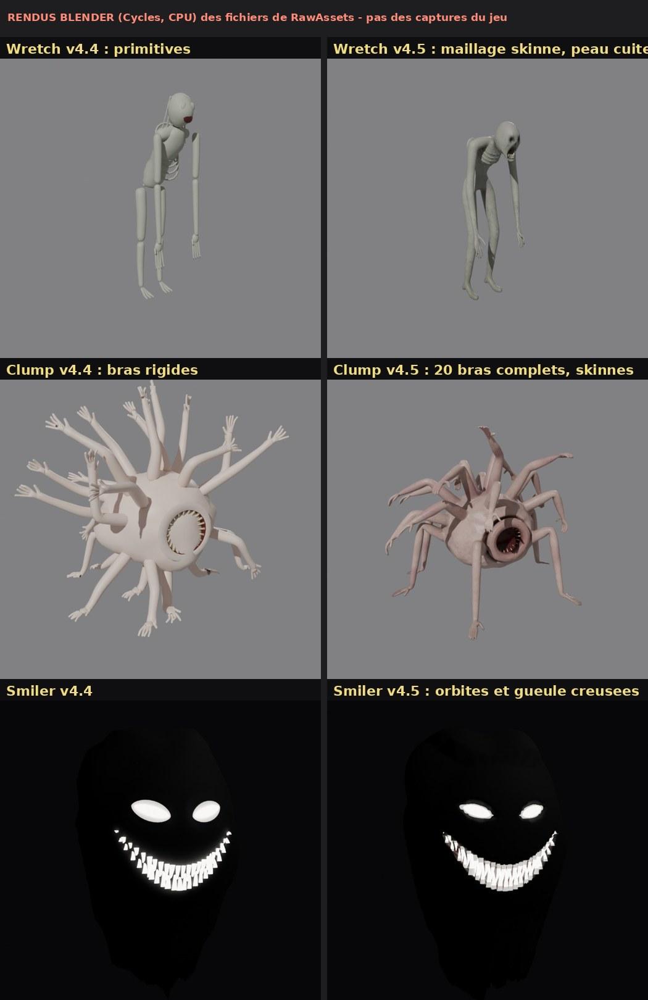
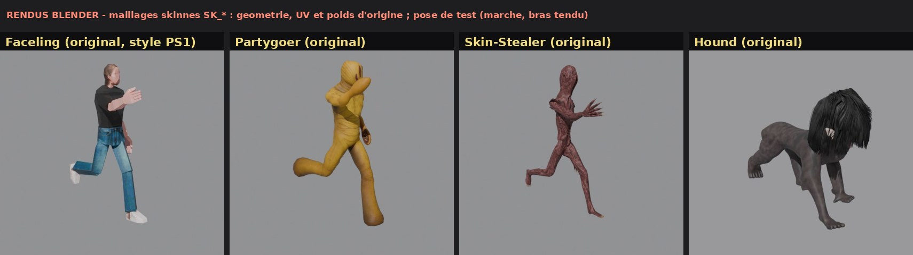
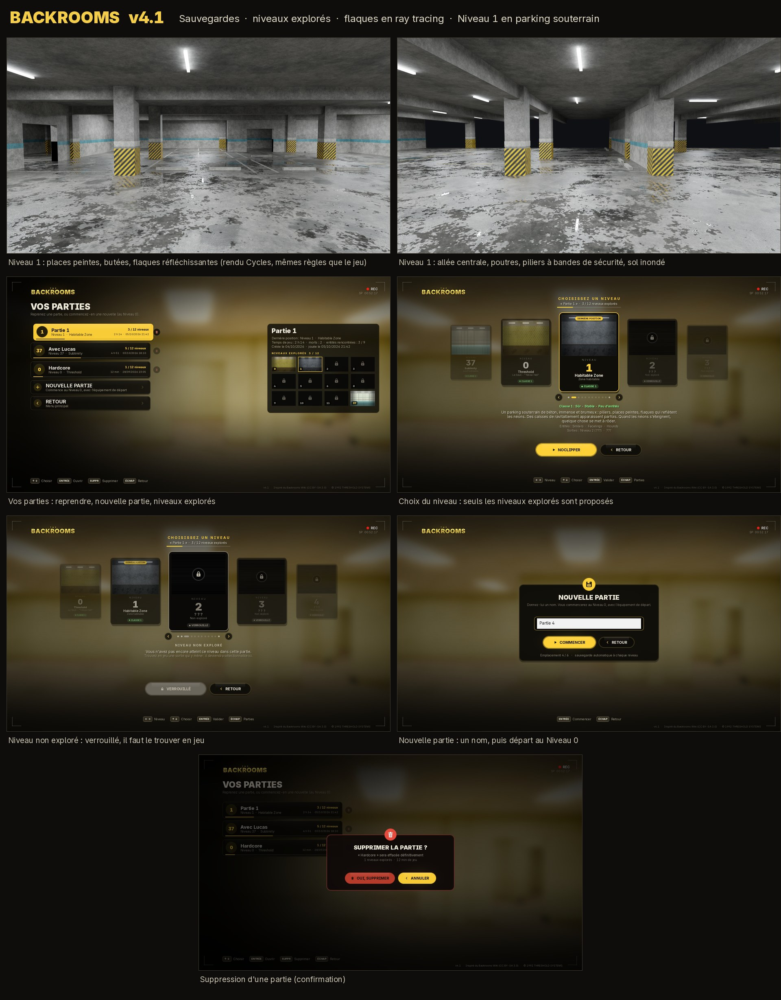
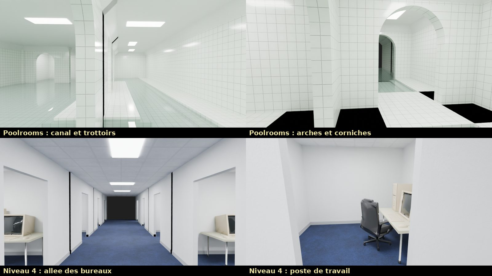
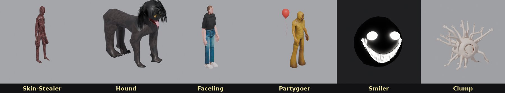

# THE BACKROOMS : Unreal Engine 5.8

> *« Si vous ne faites pas attention et que vous noclippez hors de la réalité au mauvais endroit,
> vous finirez dans les Backrooms… »*

Jeu d'exploration horrifique à la première personne, **100 % procédural et infini**, inspiré du
[Backrooms Wiki](https://backrooms-wiki.wikidot.com/normal-levels-i) (contenu sous licence CC BY-SA 3.0).
Il comprend le **Niveau 0** et **11 autres niveaux** du wiki, **9 entités**, et des modèles 3D générés par Blender.

**Nouveautés de la version 4.8** (combinaison texturée, fluidité RTX, 22 langues) :

- **Où lire** : état des lieux dans [`Docs/AUDIT_v4.8.md`](Docs/AUDIT_v4.8.md) ; tableau des bogues, contrôles, mesures à
  faire et commandes dans [`Docs/RAPPORT_v4.8.md`](Docs/RAPPORT_v4.8.md) ; couverture des traductions dans
  [`Docs/LOCALISATION_COUVERTURE.md`](Docs/LOCALISATION_COUVERTURE.md).

> **Toujours rien de compilé ni de lancé dans Unreal** (conteneur sans GPU ni moteur). La compilation, le rendu, les
> captures du jeu et les images par seconde sont **non vérifiés** ; le rapport donne les commandes pour le faire.

- **Combinaison du joueur texturée** :
  - elle était sombre et sans texture en Standalone et en version empaquetée : les matériaux maîtres ne déclaraient
    pas l'usage « maillage à squelette » ;
  - usages déclarés (import Python et C++), slots affectés par leur nom, matériau d'erreur visible au lieu d'un noir
    trompeur ;
  - diagnostic par section dans le journal et le test ;
  - `backrooms_setup.validate()` et `repair()` (réparation ciblée, rejouable).
- **Fluidité** :
  - nouveau profil **RTX FLUIDE** : ray tracing matériel, TSR à 67 %, sans *hit lighting* ni ombres ray tracées de la
    lampe ;
  - génération étalée dans un budget par image partagé (planification, sous-lots, démontage) ;
  - collisions préparées là où les joueurs vont arriver ;
  - préchargement des ressources dès le menu, précompilation des shaders (PSO) ;
  - un changement de profil s'applique aussi aux lumières déjà construites et au Hound présent ;
  - entités et eau plus noires dans les reflets.
- **22 langues** (§ 2 quater) : détectées au premier lancement, changées en jeu, enregistrées, propres à chaque joueur
  en coop. Arabe et persan de droite à gauche, chinois et japonais coupés correctement, polices Noto livrées.
  **Traductions produites automatiquement : aucune n'est encore relue** par une personne qui parle la langue.
- **Bogues** :
  - une partie d'une version plus récente n'est plus réécrite au format ancien ;
  - un échec d'écriture n'est plus effacé par l'écriture suivante ;
  - santé et coups mortels décidés par le serveur ;
  - réveil trop tôt refusé par le serveur.
- **Tests** : `-BRAutoTest -BRAutoTestV48`, et une partie v4.8 dans `-BRNetTest`.

**Nouveautés de la version 4.7** (finition et fiabilité) :

- **Où lire** : état des lieux dans [`Docs/AUDIT_v4.7.md`](Docs/AUDIT_v4.7.md) ; rapport, contrôles et validations
  restantes dans [`Docs/RAPPORT_v4.7.md`](Docs/RAPPORT_v4.7.md).

> **Toujours rien de compilé ni de lancé dans Unreal** (conteneur sans GPU ni moteur).
>
> Les contrôles faits ici :
>
> - syntaxe C++ hors moteur ;
> - modèles Python ;
> - génération rejouée sur 300 graines.
>
> Ce ne sont pas des validations du jeu. Le rapport donne chaque commande à lancer, et aucun chiffre d'images par
> seconde ni aucune capture n'y est inventé.

- **Mort et coopération** :
  - cause explicite : blessure, noyade, chute, folie ;
  - une mort dans un bassin des Poolrooms n'est plus annoncée comme une chute dans une fosse, et peut être relevée ;
  - état tenu par le serveur et répliqué à tous ;
  - réanimation vérifiée par le serveur ;
  - délai selon la cause ;
  - commandes de test et changements de niveau contrôlés par le serveur, désactivés en Shipping.
- **« Reprendre » reprend vraiment** :
  - même disposition, objectifs, objets déjà ramassés, dernier point sûr ;
  - fermer le jeu à terre n'annule plus la mort, et une mort donne toujours une nouvelle graine ;
  - anciennes parties migrées, copie de secours, fichier illisible mis de côté avec un message ;
  - écritures sur un thread de fond, dans l'ordre.
- **Attaques en trois temps** : préparation lisible (geste et cri), fenêtre d'impact (un seul coup, si la proie est à
  portée et visible), récupération. On peut esquiver en s'éloignant ou en se mettant à couvert.
- **Mouvements des entités** :
  - démarches distinctes : Bacteria saccadée, Hound au galop, Wretch qui trébuche, Skin-Stealer qui accélère d'un
    coup, Clump qui avance par appuis ;
  - chaque pied se pose sur le sol réel (genoux pliés sur un trottoir ou une marche) ;
  - pas audibles et localisables.
- **Matières** :
  - cartes de rugosité pour le papier peint, la moquette, le plafond, le béton, le métal, le carrelage, le plâtre, et
    les peaux du Wretch et du Clump ;
  - murs sans répétition visible ;
  - peintures du parking satinées ;
  - fond des fosses de nouveau noir, même sans brouillard volumétrique.
- **Fluidité** :
  - les chunks se construisent par étapes (collisions d'abord), dans un budget par image ;
  - le sol sous les joueurs est toujours terminé à temps.
- **Rythme** : calme, malaise, détection, poursuite, puis répit garanti (ni entité, ni phénomène, ni coupure).
- **Son** : sons étouffés derrière les murs, réverbération propre à chaque lieu ; les sorties restent nettes.
- **Jumpscares selon la situation** : complets pour un coup mortel, une première rencontre ou une attaque hors du champ
  de vision.
- **Confort** :
  - réglages des tremblements de la caméra, des flashs et clignotements, du flou de mouvement ;
  - aides des premières minutes au clavier ou à la manette.
- **Tests** : `-BRAutoTestV47`, et `-BRNetLag` / `-BRNetLoss` pour le test réseau.

**Nouveautés de la version 4.6** (fosses du Niveau 0) : état des lieux dans [`Docs/AUDIT_v4.6.md`](Docs/AUDIT_v4.6.md),
rapport, vérifications et commandes dans [`Docs/RAPPORT_v4.6.md`](Docs/RAPPORT_v4.6.md).
> **Toujours rien de compilé ni de lancé dans Unreal** (conteneur sans GPU ni moteur). La génération a été rejouée en
> Python sur 300 graines, la géométrie rendue dans Blender : ce sont des contrôles hors moteur, **pas une validation du
> jeu**. Le rapport donne les commandes à lancer pour la valider.

- **Salles de fosses** (« Hole Variation » du wiki), au Niveau 0 :
  - une salle jaune de 17,5 m (5 × 5 cellules), même papier peint, moquette, plafond et néons, percée d'une **grille de
    fosses carrées** de 2 m (jusqu'à 16) ;
  - entre les fosses, des **passages** de 1,5 m ; une **galerie** fait le tour de la salle, et chaque côté a une porte ;
  - **bords épais** : tranche de moquette, puis dalle de 30 cm ;
  - **parois** de béton de plus en plus sombres jusqu'à un fond noir à 14 m : la profondeur se perd dans l'obscurité,
    sans grain ni effet VHS ;
  - la lampe accroche les parois proches ;
  - néons alignés au-dessus des passages, **avec ombres** ;
  - au moins une salle par partie, jamais près du départ (paramètres `Pit*` dans `BRLevels.cpp`).
- **Vraie génération** :
  - la dalle du chunk est découpée autour des ouvertures (aucune collision au-dessus du vide) ;
  - la salle est réservée avant les murs, les cachettes, les objets et les sorties ;
  - mêmes fosses chez tous les joueurs, quel que soit l'ordre de chargement des chunks.
- **Défaut corrigé** : en v4.5, les murs tirés au hasard enfermaient des zones entières du Niveau 0 (avec
  `-BRSeed=1`, le départ ne donnait accès qu'à 21 cellules sur 1 024). Des portes sont maintenant percées au chargement
  pour tout relier au départ. Cassettes et sorties sont toujours atteignables **sans traverser de salle de fosses**.
- **Chute** :
  - on tombe vraiment en quittant un passage ;
  - sous 4,50 m, le **serveur** constate la chute, et c'est la mort par le système existant ;
  - le corps finit au fond (pas de chute infinie) et personne ne peut le relever ;
  - réveil au point de départ.

  Ce n'est pas une sortie : seul, on recommence un Niveau 0 neuf.
- **IA** :
  - les entités terrestres contournent les fosses : galerie préférée par l'A*, passages suivis au centre des cellules ;
  - pas de raccourci au-dessus du vide ;
  - au bord, elles glissent le long du passage ;
  - un dernier garde-fou les empêche de quitter le sol.
- **Mode développeur** :
  - **Suppr** (ou la console `BRPits`) place le joueur au bord de la salle ;
  - **graine de démonstration 9** : `-BRSeed=9`, ou `BRSeed 9` en console.
- **Entités** :
  - les rigs v4.5 ont été vérifiés en mouvement (`Docs/v46/blender_rigs_en_mouvement.jpg`) ;
  - **appuis au sol** : la jambe d'appui touche le sol à chaque instant du pas (avant, les pieds flottaient jusqu'à
    7,9 % de la taille du Wretch en poursuite) ;
  - **Hound allégé** `SK_HoundLite` (−49 % de sommets, mêmes corps et squelette ; l'original reste en Cinématique).
- **Détail** : chambranles autour des portes du Niveau 0.
- **Test automatique** : `-BRAutoTestPits` (vue, mesures dans chaque profil, Lumen logiciel, lampe, IA, chute,
  réveil).

**Nouveautés de la version 4.5** (qualité visuelle, entités, ray tracing, preuves) : audit dans
[`Docs/AUDIT_v4.5.md`](Docs/AUDIT_v4.5.md), rapport et limites dans [`Docs/RAPPORT_v4.5.md`](Docs/RAPPORT_v4.5.md).
> **Rien n'a encore été compilé ni lancé dans Unreal** : le travail a été fait sans le moteur (conteneur Linux sans GPU).
> Le C++ a été vérifié en syntaxe hors moteur, les modèles dans Blender. Le rapport liste ce qui reste à vérifier et
> les commandes pour le faire.

- **Modèles fournis animés d'un seul tenant** : le Faceling, le Partygoer, le Skin-Stealer et le Hound ont maintenant
  une version **skinnée** (`RawAssets/Skeletal/SK_*.fbx`) tirée de leur original **sans toucher à la géométrie** :
  mêmes sommets, mêmes UV, mêmes poids de peau (le Faceling garde ses 1 387 sommets style PS1, le Partygoer son
  sourire et son ballon rouge, tenu par l'os de la main). Le jeu les anime avec la même animation procédurale qu'avant,
  mais les **coudes, genoux et épaules se plient** au lieu de se casser. Sans ces fichiers, les pièces rigides
  reviennent automatiquement (script : `Tools/Blender/build_entity_skeletal.py`).
- **Wretch, Clump et Smiler reconstruits** (`Tools/Blender/build_creatures.py`, `import_user_models.py -- smiler`) :
  - **Wretch** : humanoïde décharné et voûté d'un seul tenant. Côtes, vertèbres et omoplates sous la peau, crâne
    allongé, orbites creuses aux yeux laiteux, mâchoire pendante aux dents jaunies. Peau cuite en 2048 px (couleur,
    normal map), 30 os.
  - **Clump** : 20 bras humains complets (épaule, coude, poignet, main à cinq doigts) fondus dans la masse, autour de la
    bouche de lamproie. 62 os : chaque bras bouge seul, six bras d'appui portent la masse.
  - **Smiler** : orbites et gueule réellement creusées dans la masse d'ombre, yeux bombés plus lumineux au centre, dents
    enracinées dans la lèvre. Son émission est calibrée surface par surface : elle était à 60 partout en v4.4, d'où
    l'aspect de panneau plat.
- **Animations par état** pour toutes les entités :
  - sursaut et tête braquée à la détection, buste penché en poursuite ;
  - armé quand la proie est à portée, frappe répliquée à tous les joueurs, puis récupération ;
  - foulée calculée à partir de la distance parcourue : les pieds ne glissent plus ;
  - Clump : mains d'appui posées au sol par **IK à deux segments** (elles ne glissent pas), la masse avance par à-coups ;
  - animation espacée au loin et hors de vue (20 fois/s au-delà de 25 m, 5 fois/s hors champ).
- **Jumpscares** : la créature finit en pose de frappe devant la caméra ; les effets d'écran sont réduits de moitié
  environ, sans « =) » géant.
- **Profils graphiques** **PERFORMANCE / QUALITÉ / CINÉMATIQUE** (voir § 7), avec le **mode de rendu réel** affiché :
  RHI, SM6, ray tracing actif ou non, Lumen matériel ou logiciel, ombres, résolution interne. Le *hit lighting* est
  réservé au profil Cinématique, ainsi que les **ombres ray tracées de la lampe** (les plafonniers gardent les VSM).
- **Décors** :
  - **plinthe moulurée** (sabot, gorge, quart-de-rond) au Niveau 0, dans les bureaux et à l'hôtel ;
  - **flaques** au contour irrégulier mais cohérent (avant : un semis de taches), avec un liseré mouillé ;
  - **ligne d'eau** sur le carrelage des Poolrooms (murs des canaux, piliers, rebords) ;
  - comparaison des flaques simulée hors moteur : `Docs/v45/flaques_avant_apres.png`.
- **Protection des modèles fournis** : `Tools/protect_assets.py` et `RawAssets/protected_assets.json` (empreintes
  SHA-256 de 82 fichiers dérivés et de 41 originaux).
  - Les scripts ne remplacent plus un dérivé protégé sans `--force`, et sauvegardent l'ancien d'abord.
  - Un modèle fourni manquant n'est plus remplacé en silence : le journal et le mode développeur le signalent.
- **Mesures** : le test automatique note désormais :
  - percentiles des temps d'image et 1 % le plus lent ;
  - GPU, thread de jeu et thread de rendu ;
  - mémoire, temps de construction des chunks ;
  - matériel et mode de rendu réel.

  Il écrit aussi un tableau `Saved/AutoTest/Mesures.csv`. `-BRSeed=<n>` fixe la disposition des niveaux, pour des
  comparaisons avant / après. La construction des chunks est limitée à 5 ms par image.
- Version des matériaux 5 : à l'ouverture de l'éditeur, les nouveaux fichiers (maillages à squelette, textures cuites,
  plinthe, Smiler) sont importés et les matériaux reconstruits, sans tout réimporter.




**Nouveautés de la version 4.4** (textures, sons, mode développeur, corps animé, Smiler, jumpscares) :
- **Les textures sont de retour.** Depuis la 4.3, le bruit doux `T_NoiseLF` (importé en linéaire) était lu par un
  échantillonneur « Color » (sRGB) : Unreal refuse alors de compiler le matériau et **tous** les murs, sols et plafonds
  s'affichaient sans texture. Le type d'échantillonneur suit maintenant le format de chaque texture (C++ et Python).
  Les matériaux sont reconstruits tout seuls à l'ouverture de l'éditeur (version des matériaux 4).
- **Sons fournis** :
  - la **Bacteria** a le son de l'enregistrement fourni (boucle de 21 s sans coupure, `S_Bacteria`), joué en continu
    autour d'elle ;
  - le **bourdonnement des néons** fourni (boucle de 30 s, `S_LightBuzz`) est l'ambiance du Niveau 0.
- **Mode développeur** (actif par défaut hors version « Shipping », réglage **MODE DÉVELOPPEUR** dans les paramètres) :
  - **tous les niveaux** sont débloqués dans le carrousel des niveaux (reprendre une partie, héberger) ;
  - un niveau visité ainsi **ne compte pas** dans la partie (pastille « hors partie ») : la sauvegarde reste intacte ;
  - touches (rappelées en jeu pendant 10 s à chaque niveau) :

    | Touche | Effet |
    |---|---|
    | **Page préc. / Page suiv.** | niveau suivant / précédent |
    | **Début** | même niveau, nouvelle disposition (autre graine) |
    | **F6** | vol libre à travers les murs (**Espace** pour monter, **Maj** pour aller vite) |
    | **F7** | invincible |
    | **F10** | jumpscare suivant (une entité à chaque appui) |
    | **Fin** | objectifs remplis (sorties ouvertes) |
    | **Inser** | coupure de courant |
    | **Suppr** | v4.6 : bord de la salle de fosses (Niveau 0, graine 9 si besoin) |
- **Corps du joueur animé** (3e personne et coéquipiers) : la combinaison hazmat est maintenant un **maillage à
  squelette** (`SK_Hazmat`, 79 os) dont la peau se plie aux genoux, aux coudes et aux épaules, sans coutures. Le C++ le
  pose **os par os** (marche, course, accroupi, nage, échelle, mort) ; l'objet tenu suit la main droite. Sans ce
  fichier, l'ancien corps en pièces rigides revient.
- **Nouveau Smiler** : une masse d'ombre informe qui s'effiloche dans le noir, deux **yeux en amande** inclinés vers le
  centre (regard mauvais, halo autour), et un **sourire en croissant** aux dents fines et serrées (22 par rangée, plus
  des crocs) sur une bouche sombre. Il éclaire légèrement ce qui l'entoure.
- **Jumpscares** : quand une entité vous frappe, son modèle se jette sur la caméra. Chacune a le sien (son, mouvement de
  caméra, effets d'image), et un coup mortel attend la fin du jumpscare :

  | Entité | Jumpscare |
  |---|---|
  | **Smiler** | tout s'éteint, le sourire fonce depuis le noir et remplit l'écran, éclair blanc |
  | **Hound** | bondit depuis le sol, la caméra est projetée, trois griffures rouges |
  | **Faceling** | s'approche lentement, tête penchée, sans visage… puis la neige d'une télévision |
  | **Skin-Stealer** | surgit de côté, la caméra est arrachée vers lui, l'image vire à la chair |
  | **Deathmoth** | un essaim de papillons traverse l'écran, le papillon s'écrase sur le visage |
  | **Wretch** | avance par à-coups entre des images noires |
  | **Partygoer** | silence… puis il est là, d'un coup : confettis, « =) » et « JOYEUX ANNIVERSAIRE » |
  | **Clump** | roule sur lui-même jusqu'à vous, la caméra encaisse le choc, pulsation rouge |
  | **Bacteria** | elle vous domine : la caméra lève les yeux, sa tête descend vers vous, l'image se brouille |

  Il n'y a pas de nouveau jumpscare pendant 5 s (sauf pour un coup mortel). Huit cris sont synthétisés (`S_Scare_*`) ;
  celui de la Bacteria (`S_Scare_Bacteria`) est tiré de l'enregistrement fourni.
- Depuis une v4.3 déjà importée, l'ouverture de l'éditeur importe seulement les nouveautés : sons, Smiler et combinaison
  à squelette (`RawAssets/Skeletal/SK_Hazmat.fbx`), puis reconstruit les matériaux.

**Nouveautés de la version 4.3** (Niveau 0 retravaillé) :
- **Sol du Niveau 0 sans répétition** : la grande tache sombre incrustée dans la texture de moquette (elle revenait tous
  les 2,2 m) a disparu. Le matériau mélange maintenant un 2e échantillon de la moquette, tourné de 37° et à une autre
  échelle, selon un bruit à grande échelle (paramètre `AntiTile`), fait varier légèrement la teinte par zones de
  plusieurs mètres, et dessine des **taches d'humidité** à l'échelle du monde (paramètre `Stains`) : aucun motif ne
  s'aligne plus. Nouvelle texture de bruits doux `T_NoiseLF` (importée en linéaire).
- **Niveau 0 plus petit** : une zone close de **112 m de côté** (4 × 4 chunks) autour du point de départ, fermée par des
  murs d'enceinte (réglage `BoundsChunks` dans `BRLevels.cpp`). Le niveau y garantit **8 cassettes VHS** (6 nécessaires),
  **2 échelles** et **2 murs qui glitchent**, tirés parmi les chunks (jamais au point de départ).
- **Murs trois fois plus épais** dans tous les niveaux (60 cm au Niveau 0, 1,20 m au parking et dans les Poolrooms…).
- **Smilers pendant les coupures** : ils apparaissaient entre 9 et 19 m, derrière les murs, et restaient immobiles hors
  de vue, si bien qu'on ne les voyait jamais. Maintenant, à chaque coupure, le premier **surgit dans votre champ de vision**
  (5 à 14 m, ligne de vue dégagée : ses yeux et son sourire s'allument dans le noir), d'autres apparaissent autour, puis
  **un nouveau toutes les 6 à 9 s** tant que dure le noir (jusqu'à 6). Dans le noir, ils **rôdent vers vous** et
  surgissent à l'angle d'une porte. Ne les éclairez pas.
- **Échelle de sortie** (à la place du sol qui glitchait) : une échelle contre un mur monte dans une **trappe du
  plafond**, d'où filtre une lueur violette. **E** pour s'y accrocher, **Z/S** (avancer / reculer) pour monter ou
  descendre, **Espace** ou **E** pour lâcher. Elle continue dans un conduit sombre de 3 m : en montant, l'image se
  déchire, puis vous **noclippez** (vers les Poolrooms). Les objectifs du Niveau 0 restent nécessaires. Les échelles
  des autres niveaux se grimpent de la même façon.
- Correction : le bruit des **flaques** (v4.1) était lu en sRGB, si bien qu'elles couvraient moins de sol que prévu ;
  elles retrouvent la taille de l'aperçu.
- Les matériaux sont reconstruits tout seuls à l'ouverture de l'éditeur (version des matériaux 3) ; la moquette et
  `T_NoiseLF` sont importées à ce moment-là, sans tout réimporter.

**Nouveautés de la version 4.2** (corrections) :
- **Les textes s'affichent à nouveau** (titres, boutons, astuces, touches, notifications…). Depuis la 4.0, l'interface
  dessinait ses textes avec la police Slate par défaut sans objet police (`UFont`) : le Canvas d'Unreal ignore alors le
  texte sans rien signaler. Les textes utilisent maintenant la police **Roboto du moteur** (`/Engine/EngineFonts/Roboto`)
  et ses graisses (fine, normale, grasse, noire si elles existent, sinon la plus proche).
- **Plus de caméscope dans la main** : la main est libre au départ (la lampe reste à la ceinture). Le caméscope est
  **dans le sac** : tant que vous l'avez sur vous, il **filme ce que vous regardez** (tâches d'enregistrement du
  Niveau 0, fiches du journal) et donne la **vision nocturne** (**N**). Il ne s'équipe plus en main ; dans une ancienne
  sauvegarde, il retourne tout seul dans le sac.
- **Plus d'écran de caméscope** : ni coins de viseur, ni « REC » avec point rouge clignotant, ni horodatage, dans le
  menu comme en jeu. Il ne reste qu'une pastille discrète « ENREGISTREMENT : … » avec sa barre de progression pendant
  une tâche, et « VISION NOCTURNE » quand elle est allumée. La batterie s'affiche dans la barre **PILES**.
- Réglages renommés : **GRAIN DE L'IMAGE** et **EFFET VHS** (lignes de balayage, légère aberration, saleté d'objectif).

**Nouveautés de la version 4.1** (sauvegardes, choix des niveaux, liquides en ray tracing) :
- **Sauvegardes** : **SOLO** ouvre la page **VOS PARTIES** (jusqu'à 6 parties).
  - **NOUVELLE PARTIE** : vous lui donnez un nom et vous commencez **toujours au Niveau 0**, avec l'équipement de départ.
  - **Reprendre une partie** : vous choisissez votre niveau, mais **seulement parmi les niveaux déjà explorés** dans
    cette partie. Les autres apparaissent verrouillés (cadenas, « ? ? ? ») : il faut d'abord les trouver en jeu, par
    une sortie. Le carrousel s'ouvre sur votre **dernière position**.
  - La partie retient les niveaux explorés, le dernier niveau atteint, l'**inventaire** et l'équipement, la santé, la
    santé mentale, les piles, le **journal** (entités rencontrées, notes lues), le temps de jeu et le nombre de morts.
  - **Sauvegarde automatique** à chaque niveau atteint, toutes les minutes, à l'ouverture de la pause et en quittant
    (une petite icône s'affiche en bas à droite). Fichiers : `Saved/SaveGames/BR_Partie_1.sav` à `_6.sav`.
  - **Supprimer** une partie : touche **Suppr** ou la corbeille à droite de la carte, puis confirmation.
  - **Multijoueur** : **HÉBERGER** passe par le même choix (partie puis niveau exploré) ; les niveaux découverts par le
    groupe s'ajoutent à la partie de l'hôte. Les invités jouent dans la partie de l'hôte.
- **Choix des niveaux amélioré** : progression de la partie (« 3 / 12 niveaux explorés »), cartes verrouillées
  (écran neigeux et cadenas), badge **DERNIÈRE POSITION**, sorties connues de chaque niveau (« Niveau 2 · ??? »), et
  sur la page VOS PARTIES, les 12 niveaux en vignettes (aperçu des niveaux explorés, cadenas pour les autres).
- **Liquides en ray tracing (RTX)** :
  - **flaques** dans le matériau des sols (`M_BR_World`) : surface plane au **reflet miroir** (rugosité 0,02), sol
    mouillé et plus sombre autour, **ronds de gouttes** qui tombent du plafond. Avec Lumen en ray tracing matériel,
    ces reflets sont tracés par la carte graphique (néons, piliers, lampe torche) ;
  - en qualité **Épique** et **Cinématique**, les reflets sont **éclairés par les rayons eux-mêmes** (hit lighting)
    et non plus par le cache de surfaces de Lumen, et les sols simplement mouillés sont aussi tracés ;
  - l'**eau translucide** (Poolrooms) reçoit les **reflets de premier plan haute qualité** de Lumen ;
  - flaques par niveau : **Niveau 1** (le garage, le plus inondé), couloirs techniques (fuites), station électrique,
    Lights Out (la lampe se reflète dans l'eau noire), grottes, **rues mouillées** de la banlieue et de la ville (les
    lampadaires s'y reflètent). Réglage par surface dans `BRLevels.cpp` : `Puddles` (part du sol inondée) et `Wetness`.
- **Niveau 1 refait en parking souterrain** : plafond à 3,60 m avec **poutres de béton** et gaines, **places peintes**
  contre les murs (et parfois en épi), **arrêts de roue**, **flèches** et **pointillés jaunes** dans les allées,
  **piliers à bandes jaunes et noires** et liseré blanc, **bande bleue** peinte le long des murs, sol inondé.
- Les matériaux sont reconstruits tout seuls à l'ouverture de l'éditeur (version des matériaux 2), sans réimporter
  textures et modèles. Aperçu : `Docs/apercu_v41.jpg` (rendu Cycles du parking avec les mêmes règles que le jeu,
  et maquette des nouvelles pages du menu).



**Nouveautés de la version 4.0** (un jeu plus beau, un menu plus accueillant) :
- **Nouveau menu principal** :
  - un vrai **logo** « THE BACKROOMS » (lettres taillées dans le papier peint du Niveau 0, néon qui grésille) ;
  - le **niveau reste visible derrière le menu** : la caméra regarde lentement autour d'elle et un **flou de profondeur**
    transforme le décor en bokeh doux ;
  - des **cartes animées** avec icône et sous-titre (« Partir seul dans l'inconnu »…), qui glissent et s'allument au
    survol ; elles arrivent en cascade à l'ouverture ;
  - une **musique d'ambiance** (32 s en boucle, nappes et boîte à musique désaccordée sur un bourdonnement de néon), des
    sons de survol et de validation ;
  - une **astuce** qui change toutes les 7 secondes (12 conseils de survie, avec vos touches) ;
  - **SOLO** : un **carrousel des niveaux** ; chaque carte montre un aperçu du niveau avec **ses vraies textures**
    (plafond et néons, papier peint, moquette, eau, ciel), son numéro, son nom et sa classe ; on clique sur une carte
    voisine pour la choisir, sur celle du centre pour noclipper ;
  - **MULTIJOUEUR** : le conseil « qui doit héberger », le niveau de départ et votre adresse IP, en panneaux lisibles ;
  - les touches s'affichent comme de **vraies touches de clavier** (le viseur du caméscope a été retiré en 4.2).
- **Interface en jeu** : polices nettes en plusieurs graisses (Roboto Light / Regular / Bold / Black du moteur),
  **formes arrondies**, notifications en pastilles, barres de vie arrondies, **pause** au même style que le menu
  (cartes, flou de l'arrière-plan), et une **carte de titre façon générique de film** à l'arrivée dans un niveau
  (bandes noires, numéro géant, filet jaune qui s'étire, classe de survie).
- **Graphismes** :
  - **brouillard volumétrique** dans tous les niveaux : halos sous chaque néon, rayons de lumière du jour sous les
    verrières des Poolrooms, faisceau de la lampe dans la poussière (désactivable dans les paramètres) ;
  - **étalonnage « cinéma »** propre à chaque niveau : ombres et hautes lumières légèrement teintées (ombres verdâtres
    et néons chauds au Niveau 0, ombres bleutées au Niveau 1, sarcelle et orange dans les couloirs techniques…) ;
  - **exposition locale** : les néons ne brûlent plus l'image et les recoins sombres gardent leur détail ;
  - image plus **nette** (filtre de netteté à partir de la qualité « Élevé »).
- Aperçu : `Docs/apercu_menu_v40.jpg` (maquette fidèle de l'interface, mêmes coordonnées que le code).

**Nouveautés de la version 3.9** (qualité maximale) :
- **Plus aucun compromis de taille** : jusqu'ici, tout tenait dans un seul zip de moins de 30 Mo (la limite d'envoi
  de fichiers de la conversation). Le projet est maintenant livré en qualité maximale, en plusieurs archives
  (voir § 1) ou directement depuis GitHub.
- **Sons** synthétisés et enregistrés en **48 kHz** (au lieu de 32 kHz, et 16 à 22 kHz pour les sons sans aigus).
- **Textures** à leur **résolution d'origine** : combinaison hazmat en **4096 px**, plâtre des Poolrooms en 2048,
  plafond du Niveau 0 et Deathmoth de nouveau en 2048, griffes du Skin-Stealer en 2048, Partygoer en 2048,
  Faceling en 1024. JPEG qualité 95 sans sous-échantillonnage des couleurs.
- **Normal maps en PNG sans perte**, à la même résolution que leur texture : plus de blocs JPEG dans les reflets du
  carrelage et des surfaces brillantes.
- **Modèles fournis sans réduction de polygones** : Hound complet avec tous ses poils (175 000 sommets au lieu de
  6 500), Skin-Stealer (46 000), combinaison hazmat (48 000), Deathmoth scanné (23 000), Clump, meubles du bureau.
  L'import active **Nanite** sur ces modèles : Unreal les affiche à pleine finesse sans coût de rendu.
- L'import passe en **version 10** (tout est réimporté automatiquement à l'ouverture de l'éditeur).

**Nouveautés de la version 3.8** (Poolrooms et Niveau 4 d'après les deux scènes fournies) :
- **Poolrooms (Niveau 37)**, sur le modèle de la carte fournie (`gm_poolrooms`) :
  - de longs **couloirs bordés de canaux** (60 cm d'eau) et de **trottoirs carrelés** au ras de l'eau. Une marche
    immergée longe chaque trottoir : on remonte du canal sans sauter, et on marche au sec (pas sur le carrelage) ;
  - des **rangées d'arches en plein cintre** à la place des portes rectangulaires ;
  - une **corniche à 45°** entre les murs et le **plafond en plâtre** ;
  - de **grandes salles inondées à colonnade régulière**. Les bassins profonds où l'on nage restent, plus rares ;
  - le **carrelage vert d'eau à joints gris** et le plâtre (avec leurs normal maps) viennent de la scène fournie ;
  - on démarre sur une **estrade sèche** au milieu de l'eau. Les vagues simulées se brisent contre les trottoirs.
- **Niveau 4 (Abandoned Office)**, sur le modèle de la scène fournie :
  - des **zones de bureaux cloisonnés** jusqu'au plafond : rangées de petits bureaux dos à dos, chacun avec sa porte
    sur une allée, des allées transversales régulières ;
  - dans chaque bureau, le **poste de travail de la scène** : bureau blanc à pieds chromés, **écran cathodique, tour
    et clavier beiges** des années 90, **chaise de bureau noire**, et parfois la **fontaine à eau** (bonbonne,
    robinets bleu et rouge). Les mêmes meubles servent dans les open spaces ;
  - **moquette bleu marine**, murs blancs avec plinthes grises, **faux plafond à dalles blanches**, plafond plus bas.
- L'import passe en **version 9** (nouveaux modèles et textures, réimport automatique à l'ouverture de l'éditeur).



**Nouveautés de la version 3.7** (entités d'après les images et les modèles fournis) :
- **Skin-Stealer** : le modèle fourni, une chair rouge à vif sans peau, des bras qui pendent jusqu'aux genoux et
  des griffes démesurées. Il garde son déguisement en combinaison hazmat et sa masse de chair au repos.
- **Hound** : le chien fourni, un corps sombre et décharné couvert de longs cheveux noirs, des yeux ambrés qui
  luisent dans le noir et la langue pendante. Ses quatre pattes sont articulées (épaule/hanche et genou) et il trotte.
- **Faceling** : le modèle fourni, de style PS1 (visage lisse, t-shirt noir, jean). Chaque Faceling est un peu plus
  clair ou plus sombre que les autres. Les silhouettes des hallucinations utilisent aussi ce modèle.
- **Partygoer** : le modèle fourni (corps jaune, sourire =) ) avec son **ballon rouge** à la main.
- **Smiler** refait d'après l'image : une masse sombre à peine visible, deux **yeux ovales lumineux** et un
  **sourire en croissant** fait de dizaines de dents fines qui brillent.
- **Clump** refait d'après l'image : une masse de chair hérissée d'une **trentaine de bras humains** terminés par des
  mains, autour d'une **bouche ronde à trois rangées de dents**. Ses huit faisceaux de bras se tordent sans arrêt,
  plus violemment quand il roule vers vous.
- Les anciens modèles procéduraux de ces six entités sont retirés. Si un nouveau modèle n'est pas importé, le jeu
  revient automatiquement à une forme de secours. L'import passe en **version 8** : il se refait tout seul à
  l'ouverture de l'éditeur et supprime les anciens modèles remplacés.



**Nouveautés de la version 3.6** (Poolrooms plus réalistes) :
- **L'eau suit le joueur** : elle est presque immobile, et ce sont les joueurs qui la font bouger. Une simulation de
  vagues (équation des ondes sur une grille de 19 m × 19 m qui accompagne le joueur, `BRWaterSim`) dessine le **sillage**
  de chacun (vague devant, creux derrière, sillage en V), les **ronds** des pas, des plongeons et des gouttes du plafond.
  Les vagues **rebondissent sur les murs et les piliers**. En multijoueur, on voit le sillage de ses coéquipiers et des
  entités. Coût : moins d'une milliseconde de processeur par image.
- **Eau toujours translucide et plus réaliste** : on voit le carrelage du fond, déformé par les vagues (réfraction). La
  couleur dépend de l'épaisseur d'eau traversée : limpide dans 45 cm d'eau, turquoise puis vert-bleu au-dessus des
  bassins profonds. Les reflets suivent la loi de Fresnel, et sous l'eau la surface vue d'en dessous montre la
  réflexion totale. Le réglage « RENDU DE L'EAU » disparaît, ainsi que le matériau *Single Layer Water* (`M_BR_Water`).
- **Caustiques réalistes** : nouvelle texture calculée en suivant la lumière à travers une surface d'eau ondulée, au
  lieu d'un réseau de lignes qui ressemblait à des fissures. Elles dérivent lentement, sont nettes sous l'eau, plus
  faibles au-dessus et s'éteignent à 2 m de la surface. Les vagues autour du joueur les déforment.
- **Carrelage refait** : émail blanc légèrement bleu-vert, joints fins gris clair, bords arrondis, et chaque carreau
  très légèrement incliné : les reflets des plafonniers se brisent d'un carreau à l'autre comme sur un vrai mur.
  Le fond est à peine teinté, et la lumière qui en rebondit colore doucement les murs.
- Le test automatique ajoute une marche dans l'eau (captures du sillage en marchant et après demi-tour), une plongée
  (surface vue de dessous) et le temps par image (processeur graphique, jeu, rendu). L'import passe en **version 7**
  et se refait tout seul à l'ouverture de l'éditeur.

**Nouveautés de la version 3.5** (corrections, équilibrage et tests automatiques) :
- **Compilation corrigée pour Unreal 5.8.3** : `BREntity.cpp` n'incluait pas `Net/UnrealNetwork.h` (le projet ne compilait
  que par chance, en build « unity »), une variable `Pawn` masquait un membre du contrôleur (erreur C4458), et une API
  dépréciée en 5.8 (`bUsedWithInstancedStaticMeshes`) est remplacée.
- **Plantage corrigé en « Standalone Game »** (ou jeu lancé avec `-game`) : le script `init_unreal.py` démarrait aussi
  hors de l'éditeur et appelait des fonctions d'édition au bout d'une seconde de jeu → plantage. Il ne s'exécute plus que
  dans l'éditeur.
- **Multijoueur réparé : le joueur qui rejoignait n'avait pas de personnage.** La carte n'a pas de point d'apparition :
  Unreal faisait apparaître tout le monde à l'origine, déjà occupée par l'hôte (« SpawnActor failed because of
  collision »). Chacun apparaît maintenant à sa place autour du point de départ, la même sur toutes les machines
  (classement par identifiant de joueur, au lieu de l'ordre de la liste des joueurs qui diffère chez le client).
- **L'eau des Poolrooms s'affiche enfin** : le matériau `M_BR_Water` ne compilait pas en SM6 (les paramètres d'ondes
  étaient lus en RGB au lieu de RGBA) ; Unreal le remplaçait par le matériau gris par défaut. L'import passe en
  version 6 et se refait tout seul à l'ouverture de l'éditeur.
- **Touches et réglages qui disparaissaient** : ils sont maintenant dans `Saved/Config/<plateforme>/BackroomsPlayer.ini`.
  Avant, ils étaient dans `GameUserSettings.ini`, qu'Unreal efface en entier quand sa version ne lui convient pas
  (réglages faits en PIE puis jeu lancé en Standalone, nouvelle version du moteur…). Les anciens réglages sont repris.
- **Bacteria rééquilibrée** (le Niveau 0 est « Classe 1 : sûr », or elle tuait un joueur immobile en moins d'une
  minute) : première ronde après 50 s au lieu de 25, repérage plus progressif (~3 s à 10 m ; plus lent si l'on est sur
  le côté, accroupi ou dans le noir), **raclement de fils** quand elle vous remarque, et poursuite à 440 cm/s : un
  sprint (470) permet désormais de la semer en cassant la ligne de vue.
- **Vision nocturne utilisable** : elle était grise (la désaturation effaçait la teinte verte) et presque noire (le
  caméscope tenu en main, collé au projecteur infrarouge, éblouissait l'exposition automatique). Elle est maintenant
  verte, le projecteur porte plus loin, l'œil s'adapte vite, et l'on regarde à travers le caméscope.
- **Niveau 6 (Lights Out)** : la lampe éclaire enfin le béton sombre (l'exposition ne pouvait pas s'adapter au noir).
- Les **murs qui glitchent** (sorties noclip) retrouvent leur effet animé ; plus de **grands disques noirs** au plafond
  autour des ampoules (la monture faisait de l'ombre à sa propre lampe) ; la porte « CHAUFFERIE » affiche la touche
  configurée au lieu de « [E] ».
- **Tests automatiques** intégrés au jeu (§ 9) : `-BRAutoTest` parcourt les 12 niveaux et les 9 entités, mesure les
  images par seconde et écrit un rapport avec captures ; `-BRNetTest` teste une partie à deux joueurs.

**Nouveautés de la version 3.4** :
- **Conseil d'hébergement** affiché dès le menu principal et sur la page MULTIJOUEUR : c'est le joueur qui a
  **l'ordinateur le plus puissant** (et la meilleure connexion) qui devrait héberger, car son PC fait tourner le monde
  et les entités pour tout le groupe.
- **Chat vocal de proximité** : on entend ses coéquipiers depuis leur personnage. La voix faiblit avec la distance et
  est **étouffée derrière les murs**. Trois modes : appuyer pour parler (**T**, par défaut), voix ouverte, micro coupé.
  Des barres s'animent à côté du nom de celui qui parle.
- **À terre, pas mort** (coopération) : un coéquipier a 30 secondes pour vous **relever** en maintenant **E** près de
  vous (3,5 s). Vous gardez votre inventaire. Sinon, réveil au point de départ ; **Espace** pour abandonner tout de suite.
- **Hallucinations** : quand la santé mentale baisse, on aperçoit une **silhouette sans visage** au coin de l'œil,
  qui disparaît dès qu'on la regarde, ou un **sourire lumineux** qui flotte dans le noir. Seul le joueur concerné les voit.
- **Paramètres complets** (sur deux colonnes) : volume général, chat vocal, luminosité, mode d'affichage (plein écran,
  fenêtré sans bordure, fenêtré), résolution de rendu (TSR), synchro verticale, limite d'images par seconde,
  balancement de la caméra.
- **Pause en ligne** : liste des joueurs, l'hôte et la latence (ping) de chacun.

**Nouveautés de la version 3.3** :
- **Menu principal** au lancement : **SOLO** (choix du niveau de départ), **MULTIJOUEUR**, **PARAMÈTRES**, **QUITTER**.
  Il se pilote à la souris ou au clavier (**↑ / ↓**, **Entrée**, **Échap** pour revenir en arrière).
- **Multijoueur en coopération**, jusqu'à 4 joueurs : un joueur héberge, les autres le rejoignent avec son adresse IP.
  Tout le groupe partage les mêmes salles, les sorties, les coupures de courant, les entités et les objectifs du Niveau 0.
  On voit ses coéquipiers en combinaison, avec leur lampe, l'objet qu'ils tiennent et leur nom. Détails au § 2 ter.
- Menu pause : nouveau bouton **MENU PRINCIPAL** (quitter la partie sans fermer le jeu).

**Nouveautés de la version 3.2** :
- **Modèles 3D invisibles corrigés** (lampes du plafond, plan d'eau, objets…). Les FBX stockaient l'échelle (×100) et la
  rotation sur le nœud de l'objet. L'importeur d'Unreal 5.5+ (Interchange) peut l'ignorer, et les modèles arrivaient alors
  100 fois trop petits. Ils sont maintenant exportés « tout intégré » : géométrie en centimètres, aucune transformation.
  Au lancement, le jeu vérifie la taille des modèles et affiche un message si l'import est à refaire.
- **Niveau 0** : les néons apparaissent au plafond. La **Bacteria fait des rondes** autour de vous et passe régulièrement
  dans votre champ de vision. Elle met un instant à vous repérer (elle s'arrête et tourne la tête), plus vite si vous
  êtes près, si vous courez ou si vous l'éclairez. **Les lampes virent au rouge à moins de 10 m d'elle.**
  Des **Smilers surgissent du noir à chaque coupure de courant** et disparaissent au retour de la lumière.
- **Cachettes** : placards de bureau (on entre) et trous dans le mur (on s'y glisse accroupi). Caché, on n'est ni vu
  ni entendu par les entités (indication « CACHÉ » à l'écran).
- **Réglages** : « EFFET CAMÉSCOPE (VHS) » à désactiver pour un écran normal (sans viseur REC, cadres, lignes,
  aberration ni saleté d'objectif). « RENDU DE L'EAU » : Single Layer Water ou eau translucide (retiré en 3.6 : l'eau
  est toujours translucide).

**Nouveautés de la version 3** :
- **Interaction corrigée** : **E** ramasse vraiment les objets. La visée suit maintenant la rotation de la caméra
  (avant, elle restait à l'horizontale et ne touchait pas les objets posés au sol). Une petite tolérance aide aussi
  à viser un objet proche.
- **Toutes les touches se reconfigurent, même en pleine partie** : onglet **TOUCHES** de l'inventaire (**Tab**) ou
  bouton **TOUCHES** du menu pause. Chaque action accepte 3 touches (clavier ou boutons de souris). Les messages
  du jeu (« [E] Ramasser »…) affichent vos touches. Les réglages sont sauvegardés.
- **L'eau bouge** : houle lente qui soulève la surface, clapot qui déforme les reflets, et **ondes circulaires**
  qui partent du joueur à chaque pas, à chaque brasse, quand il saute ou plonge dans l'eau, et quand des gouttes
  tombent du plafond. Tout est calculé dans le matériau d'eau (nœud HLSL).
- **Poolrooms refaites d'après la capture de référence** : eau limpide turquoise-verte, petit carrelage blanc cassé
  très brillant, **plafonniers ovales**, **grandes verrières inclinées** qui inondent les salles de lumière du jour.
- **Bassins profonds** où l'on **nage** : nage dans la direction du regard, plongée, apnée (jauge d'oxygène),
  remontée, sortie par le rebord. L'eau freine la marche (démarrages et arrêts plus lents), la vue est teintée sous
  la surface (brouillard turquoise, son étouffé), des projecteurs sont immergés dans les bassins.
- **Nouveau papier peint du Niveau 0** (rayures jaune-vert à chevrons, d'après l'image fournie).
- **Modèles fournis intégrés** : la **combinaison hazmat** devient le corps du joueur (visible en **vue à la 3e personne**,
  touche **V**), la **Bacteria** et le **Deathmoth** utilisent les modèles fournis (articulés). Le Skin-Stealer se
  déguise avec la vraie combinaison.

**Nouveautés de la version 2** (inspirées de *Backrooms : Escape Together*) :
- **Inventaire (TAB)** façon Escape Together : objectifs, biométrie, poches, stockage, équipement sur une silhouette,
  glisser-déposer à la souris, inspection des objets, onglets Journal et Paramètres.
- **Caméscope** (REC, vision nocturne **N**), **coupures de courant**, **cassettes VHS** à retrouver dans le Niveau 0.
- **Entités refaites** : squelette articulé (bras, avant-bras, cuisses, tibias, tête qui vous suit du regard),
  nouvelle entité **Bacteria**, comportements proches du jeu (le Smiler charge si on l'éclaire, les Partygoers chassent
  pendant les coupures, le Skin-Stealer se fait passer pour un explorateur…).
- **Graphismes** : textures **normal maps** sur tous les murs, sols et plafonds, saleté au pied des murs, néons en
  **lumières surfaciques**, **ray tracing matériel (RTX)** via Lumen, **eau Single Layer Water** avec vagues, rides,
  absorption de la lumière et caustiques animées (Poolrooms), peau en *subsurface scattering*.


---

## 1. Installation (première fois)

**Prérequis**
- Unreal Engine **5.8** (installé via l'Epic Games Launcher)
- **Visual Studio 2022** avec la charge de travail « Développement de jeux en C++ » (le projet contient du code C++)
- *(facultatif)* Blender 4.x / 5.x, uniquement si vous voulez régénérer les modèles

**Étapes**
1. Copiez le dossier `Backrooms/` où vous voulez sur votre PC.
   - **Depuis GitHub** : dépôt `Fristick/Fristick.github.io`, branche **`backrooms`**, bouton « Code » →
     « Download ZIP » (ou `git clone -b backrooms ...`), puis gardez le dossier `Backrooms/`.
2. Double-cliquez sur **`Backrooms.uproject`**.
   Unreal demande de compiler le module « Backrooms » : répondez **Oui** (1 à 3 minutes).
   *(Si la compilation échoue : clic droit sur le `.uproject` → « Generate Visual Studio project files »,
   ouvrez `Backrooms.sln` et compilez la configuration `Development Editor`.)*
3. Au **premier** lancement de l'éditeur, le script `Content/Python/init_unreal.py` importe **automatiquement**
   toutes les ressources : 73 textures (dont 28 normal maps), 33 icônes et images d'interface, 80 sons, 127 modèles (FBX) et 8 maillages à squelette. Il crée aussi
   les matériaux (`M_BR_World`, `M_BR_Mesh`, `M_BR_Skin`, `M_BR_WaterSurface`) et la carte `/Game/Backrooms/Maps/L_Backrooms`.
   Une barre de progression s'affiche, puis un message « Import terminé ».
   **Si vous aviez déjà importé une version précédente**, le script le détecte (`Saved/BackroomsSetup.txt`) et réimporte tout automatiquement.
   *(Depuis une v3.9 ou v4.0 déjà importée, seuls les nouveaux fichiers (images du menu, sons, texture T_Hazard) sont importés et les
   matériaux reconstruits (flaques), tout seuls à l'ouverture de l'éditeur.)*
4. Appuyez sur **Play** (Alt+P). Dans le menu principal, choisissez **SOLO**, puis **NOUVELLE PARTIE** (nom, puis
   **COMMENCER** : Niveau 0) ou une partie existante (choix du niveau parmi ceux déjà explorés, ← / →, puis
   **NOCLIPPER**). Pour jouer à plusieurs : **MULTIJOUEUR** (voir § 2 ter).

> Pour relancer l'import à la main : *Window → Output Log*, choisir **Python** en bas, puis
> `import backrooms_setup; backrooms_setup.run(force=True)`
>
> **Mode secours** : si l'import n'a pas pu se faire, le jeu reste texturé dans l'éditeur. Il lit alors les textures
> directement dans `RawAssets/` (avec mipmaps) et construit les matériaux en C++ (`BRMaterialBuilder.cpp`).
> Le menu titre l'indique en jaune. Les sons, eux, nécessitent l'import.

---

## 2. Contrôles

Ce sont les touches **par défaut**. **Toutes** se changent à tout moment : **Tab → onglet TOUCHES** (ou **Pause → TOUCHES**).
Cliquez sur une case, appuyez sur la nouvelle touche. **Échap** annule, **Retour arrière** vide la case, **clic droit**
efface une case, **PAR DÉFAUT** rétablit tout. Une touche déjà utilisée par une autre action lui est retirée (un message l'indique).

| Action | Clavier / souris | Manette |
|---|---|---|
| Se déplacer | **ZQSD** ou **WASD** (les deux dispositions marchent) | Stick gauche |
| Regarder | Souris | Stick droit |
| Courir | **Maj** (consomme l'endurance) | Clic stick gauche |
| S'accroupir / **plonger** (dans l'eau profonde) | **Ctrl** ou **C** | B / Rond |
| Sauter / **remonter à la surface** / se hisser hors de l'eau | **Espace** | A / Croix |
| Lampe torche (main, ceinture ou frontale) | **F** | Y / Triangle |
| Vision nocturne (caméscope sur soi) | **N** | Croix haut |
| Interagir / ramasser / lire | **E** | X / Carré |
| Utiliser la poche 1 à 4 | **1 2 3 4** (AZERTY : **& é " '**) | |
| Boire de l'eau d'amande | **B** | LB / L1 |
| Mettre un bandage | **H** | Croix bas |
| Changer les piles | **R** | RB / R1 |
| **Inventaire** (objectifs, objets, journal, paramètres) | **Tab** ou **I** | Select |
| **Vue à la 1re / 3e personne** | **V** | Clic stick droit |
| Pause (REPRENDRE, PARAMÈTRES, TOUCHES, MENU PRINCIPAL, QUITTER) | **P** ou **Échap** (dans l'éditeur, Échap arrête le PIE : utilisez **P**) | Start |
| Se cacher | Entrer dans un placard, ou **s'accroupir** dans un trou du mur | |
| **Parler** (chat vocal, mode « appuyer pour parler ») | **T** | |
| **Relever un coéquipier à terre** | **E** maintenu près de lui | X / Carré |
| Quitter (menu / pause) | **Fin** | |

**Dans l'inventaire** : **glisser-déposer** pour déplacer un objet (poches ↔ stockage ↔ équipement),
**double-clic** pour l'utiliser / l'équiper / le retirer, **clic droit** pour l'inspecter.

**Commandes console** (touche `²` ou `` ` ``) :
`BRLevel 37` (aller à un niveau) · `BRGod` (invincible) · `BRSpawn 0..8` (faire apparaître une entité ; 8 = Bacteria) ·
`BRGiveAll` (remplit l'inventaire) · `BRBlackout` (coupure de courant) · `BRObjectives` (valide les objectifs) ·
`BRSensitivity 1.5` · `BRInvertY` · v4.6 : `BRPits` (bord de la salle de fosses) · `BRSeed 9` (recharge le niveau avec
cette graine, hôte seulement).
Ligne de commande : `-BRLevel=3` pour démarrer directement sur un niveau ; `-BRSeed=9` pour une disposition fixe.

**Mode développeur** (voir les nouveautés de la 4.4) : **Page préc. / Page suiv.** (niveau suivant / précédent),
**Début** (nouvelle disposition), **F6** (vol libre), **F7** (invincible), **F10** (jumpscare suivant), **Fin**
(objectifs remplis), **Inser** (coupure de courant), **Suppr** (salle de fosses).

---

## 2 bis. L'inventaire (TAB)


L'écran reprend la disposition d'*Escape Together*, avec quelques différences :
- en-tête **MENU >** et onglets **PERSONNAGE**, **JOURNAL**, **PARAMÈTRES**, **TOUCHES** ;
- colonne de gauche : **OBJECTIFS** (ex. « FILMER PENDANT UNE COUPURE 0/1 », « TROUVER LES CASSETTES VHS 1/6 ») et
  **BIOMÉTRIE** (santé mentale, santé, endurance, piles) avec des flèches de tendance ;
- au centre : **POCHES** (4 cases, raccourcis 1 à 4) et **STOCKAGE** (20 cases) ;
- à droite : **ÉQUIPEMENT** sur la silhouette en combinaison : TÊTE (frontale), TORSE (gilet), MAIN (lampe),
  CEINTURE (lampe) ;
- pied de page « © 1992 THRESHOLD SYSTEMS », fond sombre teinté de jaune avec lignes de balayage.

Le monde **continue de tourner** quand l'inventaire est ouvert : comme dans le jeu, mieux vaut le faire à l'abri.

| Objet | Effet |
|---|---|
| Eau d'amande | +40 santé mentale, +10 santé |
| Bandages | +35 santé |
| Piles | recharge la lampe et le caméscope |
| Barre énergétique | endurance au maximum et récupération doublée pendant 30 s |
| Cassette VHS | objectif du Niveau 0 |
| Lampe torche | main ou ceinture, **F** |
| Lampe frontale | tête : éclaire en gardant les mains libres |
| Gilet de protection | torse : −30 % de dégâts |
| Caméscope | dans le sac : filme (tâches d'enregistrement), vision nocturne (**N**) |

L'onglet **PARAMÈTRES** règle la sensibilité, l'axe Y, le champ de vision, la qualité graphique, le **ray tracing matériel
(RTX)**, les reflets ray tracés haute qualité, les néons surfaciques, le brouillard volumétrique et le grain.

**v4.7, confort** (les mécaniques ne changent pas) :

- **TREMBLEMENTS DE LA CAMÉRA** : de 0 à 100 %, pour les coups reçus et les jumpscares.
- **FLASHS ET CLIGNOTEMENTS** : normaux, atténués ou aucun. Cela concerne :
  - les éclairs des jumpscares ;
  - l'écran de mort ;
  - les néons qui clignotent ;
  - le vacillement des coupures ;
  - les bandes du noclip.
- **FLOU DE MOUVEMENT** : désactivé par défaut.

Les réglages et les touches sont sauvegardés dans `Saved/Config/<plateforme>/BackroomsPlayer.ini`
(section `[/Script/Backrooms.BRKeys]` pour les touches). Ce fichier n'est jamais effacé par Unreal, contrairement à
`GameUserSettings.ini` où ils se trouvaient avant la v3.5 (ils en sont repris automatiquement).

---

## 2 ter. Multijoueur (coopération, jusqu'à 4 joueurs)

**Héberger** : menu principal → **MULTIJOUEUR** → **HÉBERGER UNE PARTIE** → choisir une de vos parties (ou en créer une)
→ choisir un niveau déjà exploré dans cette partie (← / →) → **HÉBERGER**.
La carte se recharge en mode serveur et vous êtes directement en jeu. Votre adresse IP est affichée sur la page
MULTIJOUEUR : donnez-la à vos amis. Au premier lancement, Windows peut demander d'autoriser le jeu dans le pare-feu :
acceptez (au moins pour les réseaux privés).

**Rejoindre** : **MULTIJOUEUR** → **REJOINDRE UNE PARTIE** → tapez l'adresse IP de l'hôte → **Entrée** (ou **SE CONNECTER**).
La dernière adresse utilisée est mémorisée. Si la connexion échoue, un message s'affiche au bout de 20 secondes.

**Quelle adresse ?**
- **Même réseau** (même box ou même Wi-Fi) : l'adresse locale affichée (192.168.x.x) suffit.
- **Par Internet** : l'hôte redirige le port **7777 en UDP** vers son PC dans l'interface de sa box, puis donne son adresse
  IP publique. Plus simple : un réseau virtuel (**Radmin VPN**, **ZeroTier**, **Tailscale**…). Tout le monde le rejoint et
  utilise l'adresse IP de ce réseau.
- Tout le monde doit utiliser **la même version du jeu** (la même compilation).

**Ce qui est partagé par le groupe** :
- le niveau et ses salles (même graine de génération) ; quand un joueur prend une sortie, **tout le groupe change de niveau** ;
- les coupures de courant et les lampes rouges du Niveau 0 ;
- les entités : l'hôte les simule, et elles traquent le joueur vivant le plus proche (un joueur caché est délaissé) ;
- les objectifs du Niveau 0 : les cassettes VHS et les enregistrements de chacun comptent pour tous. Un objet ramassé
  disparaît chez tout le monde.

Vous voyez vos coéquipiers en combinaison hazmat (lampe allumée, objet en main, nage), leur nom et leur distance
au-dessus de leur tête, et vous entendez leurs pas.

**Qui héberge ?** Celui qui a **l'ordinateur le plus puissant** et la meilleure connexion : son PC fait tourner le
monde, les entités et leurs déplacements pour tout le groupe, en plus de son propre affichage.

**Chat vocal de proximité** : on entend chaque coéquipier depuis son personnage. Sa voix faiblit avec la distance
(on ne l'entend plus au-delà de 25 m environ) et elle est étouffée derrière les murs. Le mode se choisit dans
**Paramètres → CHAT VOCAL** : **appuyer pour parler** (touche **T**, par défaut), **voix ouverte** ou **micro coupé**.
L'indicateur en bas à gauche montre quand votre micro transmet. **Chacun garde** son inventaire, sa santé, sa santé mentale, son
endurance et son journal.

**À terre** : en coopération, on ne meurt pas tout de suite. Un coéquipier peut vous **relever** en maintenant **E**
près de vous pendant 3,5 secondes : vous repartez avec un peu de santé et **tout votre inventaire**. Si personne ne
vient dans les 30 secondes (ou s'il ne reste personne debout), vous vous réveillez au point de départ du niveau avec
l'équipement de départ. **Espace** permet d'abandonner tout de suite. Si le groupe change de niveau, vous le suivez.

**Pause** : en ligne, le jeu ne s'arrête pas pendant la pause. **MENU PRINCIPAL** quitte la partie. Si c'est l'hôte qui
quitte, la partie se termine pour tout le monde.

**Commandes console** : `BRLevel`, `BRBlackout`, `BRObjectives` et `BRSpawn` sont exécutées par l'hôte, même tapées par un client.

**Tester seul dans l'éditeur** : flèche à côté de **Play** → *Number of Players* : **2** et *Net Mode* : **Play As Listen Server**.
Les deux fenêtres arrivent directement en partie, sans passer par le menu.

---

## 2 quater. Langues (v4.8)

- **22 langues** : français, anglais, allemand, espagnol (Espagne et Amérique latine), portugais (Brésil et Portugal),
  italien, russe, ukrainien, polonais, tchèque, hongrois, suédois, turc, indonésien, chinois simplifié et traditionnel,
  japonais, coréen, arabe, persan.
- **Au premier lancement**, le jeu prend la langue du système s'il la propose, sinon l'anglais.
- **Changer de langue** : carte **LANGUE** du menu principal, ou **Tab → PARAMÈTRES → LANGUE**. Le changement est
  immédiat (textes, nombres, dates) et enregistré dans `BackroomsPlayer.ini`.
- **En coop**, chaque joueur garde sa langue : seuls des identifiants circulent, chaque machine écrit ses textes.
- La page Langue indique pour chaque langue si sa traduction est **relue** ou **produite automatiquement, à relire**.
  En v4.8, seul le français (langue source) est relu.
- **Pour traduire ou relire** : catalogues `Content/Localization/Game/<code>/Game.po`, puis
  `python Tools/Localization/loc_build.py` (contrôle et compilation). Détails dans le rapport v4.8, § 8.
- Non traduits : les noms des entités et des lieux, les sigles (VHS, RTX), les noms des langues (toujours dans leur
  écriture) et le journal technique (`LogBackrooms`).

## 3. Mécaniques de survie

- **Santé** : les entités vous blessent. Elle remonte lentement si vous êtes au calme.
- **Santé mentale** : elle baisse avec le temps, dans le noir, près des entités et pendant les poursuites.
  En dessous de 30 % surviennent vertiges, aberrations chromatiques, murmures et faux bruits de pas.
  Sous 50 %, les **hallucinations** commencent : une silhouette sans visage au coin de l'œil (elle disparaît dès
  qu'on la regarde), un sourire qui flotte dans le noir… En multijoueur, vous êtes seul à les voir.
  À 0, la folie vous tue. **L'eau d'amande** rend +40 de santé mentale.
- **Endurance** : courir fait du bruit, et le bruit attire les entités.
- **Lampe torche** : les piles se vident en 4 minutes environ et la lampe vacille quand elles sont faibles.
  La lumière attire les Deathmoths et fait charger les Smilers.
- **Caméscope** : il reste dans le sac (pas en main, pas de viseur) ; tant que vous l'avez sur vous, il filme ce que vous
  regardez et permet la **vision nocturne** (**N**, consomme les piles).
  Filmer une entité pendant 3 secondes l'ajoute au journal.
- **Coupures de courant** (Niveaux 0, 1, 2, 3, 5) : les néons vacillent puis s'éteignent pendant 25 à 40 secondes.
  Les entités en profitent (Partygoers en chasse, Smilers plus nombreux).
- **Objectifs du Niveau 0** : comme dans Escape Together, les sorties restent **instables** tant que vous n'avez pas
  retrouvé **6 cassettes VHS** (elles luisent faiblement) et **filmé pendant une coupure** (5 secondes, caméscope sur vous).
- **Sorties** : chaque niveau contient des passages vers d'autres niveaux (mur qui « glitche », porte de secours,
  ascenseur, échelle, grange…). Ils émettent un **bourdonnement électrique** : écoutez-le pour les trouver.
  Les **échelles** se grimpent (**E** pour s'accrocher, avancer / reculer pour monter ou descendre, **Espace** pour
  lâcher) : on noclippe en haut, dans le conduit au-dessus de la trappe.
- **Notes** : des vagabonds ont laissé des notes, avec des indices et les règles de survie.
- **Eau** (Niveau 37) : l'eau ralentit la marche (jusqu'à −40 % quand elle arrive à la taille). Dans les **bassins
  profonds** (2,6 m sous le carrelage), on **nage** : on avance dans la direction du regard (regarder vers le bas pour
  descendre), **Espace** pour remonter, **Ctrl/C** pour plonger, **Maj** pour nager vite (fatigant). Sous l'eau, la
  jauge **OXYGÈNE** se vide en 18 s environ ; ensuite on se noie. Pour sortir, nagez contre un rebord sans mur au-dessus
  et appuyez sur **Espace** (ou continuez d'avancer) : le personnage se hisse sur le bord.
- **Cachettes** (Niveau 0) : placards et trous dans le mur. Une fois caché, les entités perdent votre trace (sauf si
  elles vous ont vu y entrer juste devant elles). Idéal pendant les coupures, quand les Smilers rôdent.
- **Mort** : vous vous réveillez au Niveau 0 avec l'équipement de départ (caméscope dans le sac, lampe, eau, bandage,
  piles).
- **Fosses** (Niveau 0, v4.6) : restez sur les passages. Une chute est mortelle et personne ne peut vous relever. La
  galerie qui fait le tour de la salle permet de l'éviter : cassettes et sorties ne sont jamais dedans.

L'image garde un léger grain et un effet VHS (désactivables), sans cadre de caméscope depuis la 4.2.

---

## 4. Les niveaux

| N° | Titre (wiki) | Ambiance dans le jeu | Entités | Sorties |
|---|---|---|---|---|
| **0** | *Threshold* (« The Lobby ») | Salles jaunes (zone close de 112 m), papier peint en relief, moquette humide, prises et aérations, néons qui bourdonnent, clignotent, sautent lors des coupures et **rougissent près de la Bacteria**. Placards et trous dans le mur pour se cacher | Bacteria (fait des rondes), Smilers (dans le noir et à chaque coupure) | Zone close de 112 m. Mur qui glitche → 1, échelle vers une trappe du plafond → 37 (on noclippe en montant). **Objectifs requis** : 6 cassettes VHS + filmer une coupure |
| **1** | *Habitable Zone* | Entrepôt de béton brumeux, piliers, flaques, caisses | Smilers, Facelings, Hounds | Porte de secours → 2, ascenseur → 4 |
| **2** | *Abandoned Utility Halls* (« Pipe Dreams ») | Labyrinthe de couloirs étroits, tuyaux, ampoules orange | Wretches, Hounds, Clump, Smilers | Porte → 3, échelle → 1 |
| **3** | *Electrical Station* | Briques, grilles métalliques, armoires électriques, vacarme de machines | Hounds, Skin-Stealers, Smilers, Deathmoths, Wretches | Ascenseur → 4, porte → 2 |
| **4** | *Abandoned Office* | Rangées de petits bureaux cloisonnés (ordinateur beige, chaise noire, fontaine à eau), allées à moquette bleu marine, faux plafond blanc ; quelques open spaces. Beaucoup d'eau d'amande | Facelings, Partygoer (rare) | Porte → 5, ascenseur → 1 |
| **5** | *Terror Hotel* | Couloirs d'hôtel des années 1920, moquette rouge, appliques, portes numérotées | Skin-Stealers, Partygoers, Facelings | Porte « chaufferie » → 6 |
| **6** | *Lights Out* | Obscurité totale : seule votre lampe éclaire | Smilers (nombreux) | Échelle → 8 |
| **8** | *Cave System* | Grottes rocheuses, vieilles lampes de mine | Deathmoths, Clump, Hounds | Échelle → 9 |
| **9** | *The Suburbs* | Banlieue infinie la nuit, maisons, lampadaires au sodium | Skin-Stealers, Hounds, Facelings | Porte de maison entrouverte → 10 |
| **10** | *Field of Wheat* | Champ de blé infini sous un ciel couvert, granges, poteaux | Faceling (paisible) | Grange → 11 |
| **11** | *The Endless City* | Ville infinie de gratte-ciel, en plein jour | Facelings (paisibles) | Porte d'immeuble → niveau aléatoire |
| **37** | *Sublimity* (« Poolrooms ») | Couloirs en carrelage vert d'eau bordés de canaux et de trottoirs, arches en plein cintre, corniches sous un plafond en plâtre, grandes salles inondées à colonnades, plafonniers ovales et grandes verrières inclinées. Eau tiède, limpide et turquoise, presque immobile : ce sont les joueurs qui la font onduler (sillage simulé, réfraction, caustiques). **Bassins profonds** où l'on nage, éclairés par des projecteurs immergés | aucune | Sol qui glitche → 0, échelle → 4 |

Chaque niveau est une grille **infinie** (sauf le Niveau 0, une zone close de 112 m depuis la v4.3) générée par hachage déterministe à partir d'une graine. Elle est chargée par morceaux de 8×8 cellules (« chunks ») autour du joueur, et chaque visite produit une nouvelle disposition.
Algorithmes : salles aléatoires (0, 1, 4, 6, 37), labyrinthe (2, 3), couloirs d'hôtel (5), grottes (8),
quartier pavillonnaire (9), espace ouvert (10), îlots urbains (11).

---

## 5. Les entités

| Entité | N° wiki | Comportement dans le jeu | Comment survivre |
|---|---|---|---|
| **Bacteria** | (Niveau 0) | *(modèle fourni)* Silhouette démesurée en fils torsadés, aux gestes saccadés. Erre, vous traque dès qu'elle vous voit ou vous entend, puis fouille votre dernière position | Casser la ligne de vue : portes, virages. Ne pas courir vers elle |
| **Smilers** | 3 | *(d'après l'image fournie)* Flottent dans le noir et approchent quand on ne les regarde pas. **Chargent** dès qu'on les éclaire plus d'une fraction de seconde | Éteindre la lampe, reculer lentement. Une zone bien éclairée les dissipe. |
| **Deathmoths** | 4 | *(modèle fourni : phalène scannée)* Papillons géants volants, attirés par la lampe torche, piqûre toxique | Éteindre la lampe |
| **Clump** | 5 | *(d'après l'image fournie)* Masse de bras humains autour d'une bouche dentée, qui roule vers vous en agitant ses mains | Le semer dans les couloirs |
| **Hounds** | 8 | *(modèle fourni)* Rôdent à quatre pattes, sentent la peur et chargent si vous courez ou leur tournez le dos | Les regarder en face et reculer en marchant : ils finissent par fuir |
| **Facelings** | 9 | *(modèle fourni)* Humains sans visage, surtout passifs. 15 % sont des adultes agressifs. Dans le champ de blé (Niveau 10), certains se tapissent dans les blés et vous attrapent | Garder ses distances |
| **Skin-Stealers** | 10 | *(modèle fourni)* Masse de chair au repos ; à votre approche, se transforme en « explorateur en combinaison » (la même combinaison hazmat que la vôtre) qui marche vers vous, puis se révèle et charge | Se méfier des silhouettes en combinaison. Fuir et casser la ligne de vue |
| **Wretches** | 15 | Vagabonds dégénérés, lents mais tenaces | Ne pas se laisser acculer |
| **Partygoers** | 67 | *(modèle fourni)* =) Restent immobiles en souriant, un ballon rouge à la main. Partent en chasse si vous soutenez leur regard plus de 3 s, ou pendant une coupure | Détourner le regard, se cacher pendant les coupures |

Les humanoïdes ont un **squelette articulé** (torse, tête, bras, avant-bras, cuisses, tibias) animé de façon procédurale
en C++ : marche avec flexion des genoux, bras tendus pendant les poursuites, tête qui suit le joueur, spasmes de la Bacteria.
Les Hounds marchent à quatre pattes (pattes en deux segments). Les bras du Clump ondulent en huit faisceaux indépendants.
Les entités se déplacent grâce à un **A\*** sur la grille du niveau, sans NavMesh.
Le journal (**Tab**) enregistre chaque entité rencontrée, avec sa fiche et un conseil.

---

## 6. Structure du projet

```
Backrooms/
├── Backrooms.uproject           Projet UE 5.8 (plugins : EnhancedInput, PythonScriptPlugin, EditorScriptingUtilities)
├── Config/                      Lumen, ombres virtuelles, mode de jeu par défaut, Enhanced Input
├── Source/Backrooms/
│   ├── BRTypes.h                Structures des niveaux, hachage déterministe
│   ├── BRLevels.cpp             ★ Définition des 12 niveaux (tout est réglable ici)
│   ├── BRWorld.*                Grille infinie, streaming, A*, ambiance, transitions, entités, état partagé en réseau
│   ├── BRWaterSim.*             Vagues autour du joueur (sillages, ronds dans l'eau, rebonds sur les murs)
│   ├── BRChunk.*                Construction d'un chunk : murs, portes, néons, accessoires, bassins (instances)
│   ├── BREntity.*               Les 9 entités : fiches, IA, squelette articulé, animation procédurale
│   ├── BRCharacter.*            Joueur : inventaire, équipement, caméscope, lampe, endurance, santé mentale,
│   │                            nage / apnée, corps en combinaison (squelette posé os par os) et vue à la 3e personne
│   ├── BRJumpscare.cpp          Jumpscares : un par entité (mouvement, caméra, son, effets ; décor dessiné par BRHUD)
│   ├── BRKeys.*                 Touches configurables (3 par action), sauvegarde, libellés « [E] »
│   ├── BRConfig.*               Fichier des réglages du joueur (Saved/Config/<plateforme>/BackroomsPlayer.ini)
│   ├── BRAutoTest.*             Tests automatiques (-BRAutoTest, -BRNetTest) : captures, images/s, rapport
│   ├── BRRig.*                  Humanoïdes articulés ; v4.5 : maillages à squelette pilotés par des pivots (FBRSkinDriver)
│   ├── BRItems.*                Catalogue des objets (nom, icône, effet, emplacement)
│   ├── BRPlayerController.*     Entrées (Enhanced Input en C++), menu principal, multijoueur, inventaire, paramètres, console
│   ├── BRSave.*                 Sauvegardes : parties (6 emplacements), niveaux explorés, inventaire, journal
│   ├── BRHUD.*                  Interface (Canvas) : menu titre animé, parties, carrousel des niveaux, pause,
│   │                            carte de titre, inventaire TAB façon Escape Together
│   ├── BRInteractables.*        Objets à ramasser et sorties de niveau (verrouillées par les objectifs)
│   ├── BRAssets.*               Chargement des ressources + matériaux + secours (textures lues dans RawAssets)
│   └── BRMaterialBuilder.*      Construction des matériaux maîtres en C++ (éditeur) si l'import Python manque
├── Content/Python/
│   ├── init_unreal.py           Lancé automatiquement par l'éditeur
│   └── backrooms_setup.py       Import des textures, icônes, sons, FBX + création des matériaux et de la carte
├── RawAssets/                   Ressources sources (déjà générées)
│   ├── Textures/ (+ normal maps *_N)  Icons/  Sounds/  Meshes/ (FBX)  Skeletal/ (FBX à squelette)  Previews/
│   ├── protected_assets.json    v4.5 : empreintes des fichiers tirés des modèles fournis (Tools/protect_assets.py)
├── Tools/
│   ├── Blender/generate_models.py    ★ Modélisation procédurale (décor, objets, formes de secours) + icônes (Blender)
│   ├── Blender/preview_entities.py   Rendu d'aperçu des entités assemblées
│   ├── Blender/build_hazmat_skeletal.py  Combinaison du joueur en maillage à squelette (SK_Hazmat.fbx)
│   ├── Blender/build_entity_skeletal.py  v4.5 : Faceling, Partygoer, Skin-Stealer, Hound skinnés (géométrie d'origine)
│   ├── Blender/build_creatures.py    v4.5 : Wretch et Clump reconstruits (squelettes, peau cuite)
│   ├── Blender/render_compare.py     v4.5 : rendus Blender avant / après (Docs/v45)
│   ├── protect_assets.py             v4.5 : protection des modèles fournis (check / update / list)
│   ├── verify_pitfalls.py            v4.6 : génération du Niveau 0 rejouée en Python (fosses, accès, raccords, IA)
│   ├── Blender/render_pitroom.py     v4.6 : rendu Blender de la salle de fosses générée (Docs/v46)
│   ├── Blender/check_rig_motion.py   v4.6 : maillages à squelette livrés, posés en mouvement et mesurés
│   ├── Blender/build_hound_lite.py   v4.6 : SK_HoundLite (Hound allégé, même corps et même squelette)
│   ├── Blender/import_user_models.py Découpe des modèles fournis en pièces articulées (hazmat, Bacteria, Deathmoth,
│   │                                 Skin-Stealer, Faceling, Partygoer, Hound) + Smiler et Clump d'après les images,
│   │                                 meubles et textures des scènes fournies (Niveau 4, Poolrooms)
│   ├── SourceModels/                 (non versionné) Les fichiers d'origine des modèles fournis
│   ├── generate_textures.py          Textures procédurales « tileables » (numpy + Pillow)
│   ├── generate_ui.py                Logo, icônes du menu, dégradés et formes arrondies de l'interface
│   └── generate_sounds.py            Synthèse de tous les sons (numpy)
└── Docs/                        Images d'aperçu
```

### Régénérer les ressources
```bash
# Modèles 3D (avec votre Blender installé)
blender -b -P Tools/Blender/generate_models.py              # tous les modèles
blender -b -P Tools/Blender/generate_models.py -- SM_Smiler # un seul
# Textures et sons (Python 3 + numpy + pillow)
python Tools/generate_textures.py
python Tools/generate_sounds.py
python Tools/generate_ui.py      # logo et images du menu (police Inter, fournie avec Blender)
# Modèles fournis (placer asyc_hazmat.glb, bacteria_recreation.blend, « peppered moth.obj » et sa texture,
# skin_stealer.usdz, faceling.glb, partygoer.fbx + partygoer_BaseColor.jpeg, hound.blend + hound_Material.png,
# backrooms_lvl4_office.glb, poolrooms/ (pooltile_1.png, pooltile_n_0.png, plaster_4.png, plaster_n_3.png)
# dans Tools/SourceModels/ ; détails en tête du script)
blender -b -P Tools/Blender/import_user_models.py
blender -b -P Tools/Blender/import_user_models.py -- smiler   # un seul (smiler, clump, hazmat...)
blender -b -P Tools/Blender/build_hazmat_skeletal.py -- Tools/SourceModels   # combinaison à squelette
# v4.5 (avec le module pip "bpy" : python au lieu de blender -b -P)
python Tools/Blender/build_entity_skeletal.py -- faceling partygoer skinstealer hound --preview   # SK_* des modèles fournis
python Tools/Blender/build_creatures.py -- wretch clump --preview                                 # Wretch, Clump
python Tools/protect_assets.py check        # empreintes : dérivés protégés et originaux inchangés ?
# v4.6
python Tools/verify_pitfalls.py --seeds 1-24 --maps Docs/v46/cartes_24_graines.png   # fosses, accès, raccords, IA
python Tools/verify_pitfalls.py --seed 9 --json pit.json && python Tools/Blender/render_pitroom.py -- pit.json Docs/v46/blender_fosses
python Tools/Blender/check_rig_motion.py -- Docs/v46/blender_rigs_en_mouvement.jpg
python Tools/Blender/build_hound_lite.py -- --preview Docs/v46/blender_hound_original_vs_lite.jpg   # (--force pour refaire)
```
Les fichiers tirés des modèles fournis sont **protégés** : un script relancé ne les remplace pas (« PROTEGE, non
remplacé »). Pour les régénérer volontairement, ajoutez `--force` : l'ancienne version est d'abord copiée dans
`RawAssets/_Backup/<date>/`. Ensuite, `python Tools/protect_assets.py update` enregistre les nouvelles empreintes.
Ensuite, dans Unreal : `import backrooms_setup; backrooms_setup.run(force=True)`.


### Ajouter ou modifier un niveau
Tout se passe dans `Source/Backrooms/Private/BRLevels.cpp`. Chaque niveau est une fonction `LevelX()` qui règle
la grille (taille des cellules, densité des murs…), les surfaces (texture, teinte, échelle), l'éclairage
(type de néon, densité, clignotement, zones mortes), l'atmosphère (brouillard, ciel, exposition), le son,
les entités, les objets et les sorties. Ajoutez votre fonction à `BuildAll()`, et le niveau apparaît dans le menu.

---

## 7. Graphismes, RTX et performance

- Éclairage entièrement dynamique : **Lumen** (GI + reflets) et **Virtual Shadow Maps**.
- **RTX** : `r.RayTracing` et `r.Lumen.HardwareRayTracing` sont activés dans `Config/DefaultEngine.ini` (DirectX 12, SM6,
  *Support Compute Skin Cache* et maillages à squelette dans le ray tracing). Sur une carte compatible (GeForce RTX,
  Radeon RX 6000+), Lumen utilise le ray tracing matériel ; sinon il revient automatiquement au mode logiciel, et le
  menu l'affiche (« INDISPONIBLE »). *Changer de RHI ou de support du ray tracing demande un redémarrage (recompilation
  des shaders, plusieurs minutes la première fois).*
- **Profils graphiques** (v4.5, Paramètres → PROFIL GRAPHIQUE). Le mode réellement actif est écrit en bas de la page des
  paramètres et dans la pastille du mode développeur :

  | Profil | Qualité | Lumen | Reflets | Ombres | Rendu (TSR) | Néons surfaciques |
  |---|---|---|---|---|---|---|
  | **Performance** | Élevé | logiciel | cache de surfaces | VSM | 67 % | non |
  | **Qualité** (défaut) | Épique | ray tracing matériel | cache de surfaces, reflets de premier plan de l'eau | VSM | 80 % | oui |
  | **Cinématique** | Cinématique | ray tracing matériel | *hit lighting* (éclairés par les rayons) | VSM + lampe ray tracée | 100 % | oui |
  | **RTX fluide** (v4.8) | Épique | ray tracing matériel | cache de surfaces | VSM | 67 % | oui |

  **v4.8** : les ombres des néons s'arrêtent à 15 m (Performance), 25 m (Qualité, RTX fluide) ou 40 m (Cinématique).
  Le Hound complet (175 000 sommets) n'est utilisé qu'en Cinématique, ou avec **MODÈLES COMPLETS DES ENTITÉS** en Personnalisé. Un
  changement de profil s'applique aussi à ce qui est déjà chargé. **RTX fluide** vise 60 images/s ou plus sur une
  RTX 4080 ; **ce n'est pas encore mesuré** (rapport v4.8, § 4.2).

  Modifier un réglage à la main passe en **PERSONNALISÉ** ; des réglages d'une version précédente sont conservés tels
  quels (profil Personnalisé). Tout s'applique immédiatement, sauf le RHI et le support du ray tracing.
  *Choix des ombres* : les dizaines de plafonniers fixes gardent les ombres virtuelles (VSM, mises en cache) ; la lampe
  torche bouge à chaque image (elle invaliderait ses pages VSM en permanence) : en Cinématique, elle passe en ombres
  ray tracées, nettes au contact. L'objectif de 60 images/s en profil Qualité **n'est pas encore mesuré** (voir le rapport).
- **Entités dans les reflets** : les entités à squelette (`SK_*`) sont dans la scène de ray tracing grâce au cache de
  skinning. En Lumen logiciel, elles n'ont pas de champ de distance : seuls les reflets en espace écran les montrent.
  À vérifier en jeu (rapport, § Non vérifié).
- **Murs** : projection triplanaire dans l'espace monde (aucune texture étirée), **normal maps** (relief du papier peint,
  de la moquette, des joints), saleté à grande échelle, saleté au pied des murs, rugosité variable. Sur les sols qui le
  demandent (`AntiTile`, `Stains`), un 2e échantillon tourné casse la répétition et des taches d'humidité sont dessinées
  à l'échelle du monde.
- **Néons** : lumières **surfaciques** (rect lights) pour des ombres douces ; seule une partie projette des ombres (`ShadowChance`).
- **Eau** (Poolrooms) : matériau translucide `M_BR_WaterSurface`. Il lit l'image et la profondeur de la scène derrière
  l'eau (`SceneColor`, `SceneDepth`), les décale selon la pente de la surface (réfraction) et les atténue selon
  l'épaisseur d'eau traversée, couleur par couleur (absorption). S'y ajoutent Fresnel, reflets Lumen (*front layer*) et
  réflexion totale vue de dessous. La surface : houle et clapot de fond (nœud HLSL, *World Position Offset* sur une
  grille subdivisée), rides en normal map, et surtout les **vagues simulées** par `UBRWaterSim` : équation des ondes
  sur 320 × 320 cases de 6 cm qui suivent le joueur (pas fixes de 1/60 s, calcul en parallèle). Les joueurs et les
  entités y poussent l'eau, les murs et piliers du niveau renvoient les vagues, et les pentes sont envoyées chaque pas
  à une texture lue par l'eau et par les caustiques du carrelage. Réglages par niveau dans `BRLevels.cpp` :
  `WaterAbsorption` (limpidité), `WaterScattering` (voile de l'eau profonde), `WaterWaves` (houle), `WaterChop` (clapot).
- **Nanite** : les pièces rigides des modèles fournis (combinaison hazmat, meubles du bureau, Smiler) sont gardées à
  pleine résolution avec Nanite. Les maillages **à squelette** (`SK_*`) n'utilisent pas Nanite : l'import leur génère
  des niveaux de détail (`SKELETAL_LODS` dans `backrooms_setup.py`). Le Hound garde son pelage d'origine
  (175 000 sommets) au plus près : son coût (cache de skinning et ray tracing) est à mesurer.
- **Brouillard volumétrique** (tous les niveaux) : chaque néon diffuse un peu de sa lumière dans l'air
  (`VolumetricScatter` par niveau dans `BRLevels.cpp`), les verrières des Poolrooms projettent des rayons, la lampe
  trace un faisceau. Option **BROUILLARD VOLUMÉTRIQUE** dans les paramètres.
- **Étalonnage par niveau** : `ShadowTint` et `HighlightTint` dans `BRLevels.cpp` (gain des ombres et des hautes
  lumières du post-process), **exposition locale** (contraste des hautes lumières 0,8, des ombres 0,9, détail 1,12),
  filtre de netteté `r.Tonemapper.Sharpen`.
- **Menu et pause** : flou de profondeur cinématographique (mise au point à 25 cm, ouverture f/1,4) sur le niveau
  affiché derrière.
- Sur une petite configuration : onglet **PARAMÈTRES** (qualité « MOYEN », RTX désactivé, néons surfaciques désactivés),
  ou baissez `ViewDistance` / `LightChance` dans `BRLevels.cpp`.

## 8. Dépannage

| Problème | Solution |
|---|---|
| « Missing modules / Could not be compiled » | Installer Visual Studio 2022 + « Développement de jeux en C++ », puis recompiler via le `.sln` |
| Murs sans texture / tout est gris | Corrigé en v2 : les matériaux sont marqués « Used with Instanced Static Meshes » (sans ce drapeau, Unreal affichait le matériau par défaut) et le jeu se replie sur les textures de `RawAssets/`. Pour un résultat optimal, relancer `backrooms_setup.run(force=True)` depuis l'Output Log Python |
| Les murs apparaissent gris quelques secondes | Mode secours : Unreal compile les matériaux à la volée la première fois |
| L'eau est opaque / noire / grise | Depuis la v3.6, l'eau est toujours translucide. Ouvrez l'éditeur une fois : l'import v7 se relance tout seul. Sinon : `import backrooms_setup; backrooms_setup.run(force=True)` |
| Le jeu plante au bout d'une seconde en « Standalone Game » | Corrigé en v3.5 (`init_unreal.py` ne s'exécute plus hors de l'éditeur) |
| Un ami qui rejoint la partie n'a pas de personnage / ne peut pas bouger | Corrigé en v3.5 (point d'apparition occupé par l'hôte). Tout le monde doit utiliser la même compilation |
| Mes touches et réglages ont disparu | Corrigé en v3.5 : ils sont dans `BackroomsPlayer.ini`, qu'Unreal n'efface pas |
| Sons absents | Vérifier que `/Game/Backrooms/Sounds` existe. Relancer l'import |
| Écran noir au lancement | C'est le fondu d'entrée ; dans le Niveau 6, c'est normal (**F** pour la lampe) |
| La souris ne tourne pas la caméra | Cliquer dans la fenêtre de jeu (capture de la souris). La caméra est bloquée tant que l'inventaire (TAB) est ouvert |
| Les touches 1 à 4 ne marchent pas | En AZERTY, les touches **& é " '** sont aussi reconnues ; sinon utiliser le pavé numérique |
| Trop sombre / trop clair | Ajuster `MinEV` / `MaxEV` / `ExposureBias` du niveau dans `BRLevels.cpp` |
| Pas de lampes au plafond, pas d'eau, objets invisibles | Corrigé en v3.2 (échelle des FBX). Laissez l'import se relancer au démarrage de l'éditeur (v7). Si un message rouge parle d'échelle : `import backrooms_setup; backrooms_setup.run(force=True)` |
| L'eau n'apparaît toujours pas | Relancer l'import : `import backrooms_setup; backrooms_setup.run(force=True)` (Output Log, onglet Python) |
| Je veux l'image sans effet VHS | **Tab → PARAMÈTRES → EFFET VHS : DÉSACTIVÉ** (le cadre du caméscope n'existe plus depuis la 4.2) |
| Aucun texte dans le menu (seulement les icônes) | Corrigé en 4.2 (police du Canvas). Recompilez le module C++ |
| **E** ne ramasse rien | Corrigé en v3. Visez l'objet (le point au centre grossit et « [E] Ramasser » s'affiche). Si vous avez changé la touche, le message affiche la nouvelle |
| Une action ne répond plus | Une touche a pu lui être retirée en la donnant à une autre action : **Tab → TOUCHES**, ou **PAR DÉFAUT** |
| « Impossible de rejoindre la partie » | L'hôte doit avoir cliqué sur **HÉBERGER UNE PARTIE**. Vérifiez l'adresse, la redirection du port **7777 UDP** sur la box de l'hôte et son pare-feu Windows. Sinon, passez par Radmin VPN, ZeroTier ou Tailscale |
| On n'entend pas les autres | Vérifiez **Paramètres → CHAT VOCAL**. En « appuyer pour parler », il faut maintenir **T**. Vérifiez aussi l'accès au micro dans Windows (*Paramètres → Confidentialité → Microphone*) et le micro par défaut. Dans l'éditeur (PIE), le chat vocal peut ne pas fonctionner : testez en *Standalone Game* ou avec le jeu empaqueté, sur deux PC |
| « Connexion perdue avec l'hôte » | L'hôte a quitté la partie, ou la connexion a coupé : rejoignez à nouveau |
| Un ami ne voit pas les mêmes salles | Vous n'avez pas la même version du jeu : utilisez tous la même compilation |
| Les entités ont encore leur ancienne apparence | Les modèles v3.5 (`SM_*ET*`) ne sont pas importés : relancer `backrooms_setup.run(force=True)` |
| Le menu n'a pas de musique / pas de logo | Les nouvelles ressources v4.0 (`UI_*`, `S_MenuTheme`, `S_UIHover`, `S_UIConfirm`) ne sont pas encore importées : rouvrez l'éditeur ou lancez `backrooms_setup.run()`. Sans import, le logo est lu dans `RawAssets/Icons`, mais les sons manquent |
| Pas de flaques au sol / reflets flous | Les matériaux v4.1 ne sont pas encore reconstruits : rouvrez l'éditeur (ou `backrooms_setup.run()`). Les reflets les plus nets demandent le ray tracing matériel (**Paramètres → RTX**) et la qualité **Épique** ou **Cinématique** |
| Un niveau est verrouillé dans le menu | Normal : seuls les niveaux déjà explorés dans la partie choisie sont proposés. Trouvez une sortie qui y mène en jeu |
| Où sont mes sauvegardes ? | `Saved/SaveGames/BR_Partie_1.sav` à `BR_Partie_6.sav` (dossier du projet, ou du jeu empaqueté) |
| Le jeu rame depuis la v4.0 | Désactivez **BROUILLARD VOLUMÉTRIQUE** dans les paramètres, ou baissez la qualité |
| La combinaison n'apparaît pas en 3e personne | Le jeu affiche des boîtes jaunes si les modèles `SM_Hazmat_*` ne sont pas importés : relancer l'import |
| La combinaison est sombre, grise ou sans texture (v4.8) | Les matériaux maîtres d'avant la v4.8 n'ont pas l'usage « maillage à squelette ». Ouvrez l'éditeur une fois (reconstruction automatique, matériaux v7), ou dans l'Output Log (Python) : `import backrooms_setup; backrooms_setup.repair()`. Une section **magenta** signale un slot inattendu : le journal (`LogBackrooms`) dit lequel |
| Des carrés à la place des lettres (chinois, japonais, coréen, arabe, persan) | Les polices de `Content/Fonts` manquent dans le paquet. Vérifiez `+DirectoriesToAlwaysStageAsUFS=(Path="Fonts")` dans `Config/DefaultGame.ini` et recuisez. Le journal liste les fichiers absents au lancement |
| Le jeu reste en français ou ne change pas de langue | Le paquet doit contenir les cultures (`InternationalizationPreset=All` et `+CulturesToStage=` dans `DefaultGame.ini`) et les fichiers `Content/Localization/Game/<code>/Game.locres` |
| Je veux revenir à la langue du système | Supprimez la ligne `Language=` de `Saved/Config/<plateforme>/BackroomsPlayer.ini` |

## 9. Tests automatiques

Le jeu contient deux tests qui se pilotent seuls et se ferment à la fin. Lancez-les depuis un terminal
(adaptez le chemin d'Unreal et du projet) :

```bat
"C:\Program Files\Epic Games\UE_5.8\Engine\Binaries\Win64\UnrealEditor.exe" "C:\...\Backrooms.uproject" -game -windowed -ResX=1600 -ResY=900 -BRAutoTest
```

- **`-BRAutoTest`** (solo, ~10 min) : pour chaque niveau, chargement, mesure des images par seconde, captures devant et
  derrière, apparition de chaque entité du niveau (figée le temps de la photo), coupure de courant, lampe, vision
  nocturne, nage dans un bassin profond et plongée (Niveau 37), marche dans l'eau (sillage) ; puis galerie des 9 entités,
  inventaire, 3e personne, mort et réveil. Résultats : `Saved/AutoTest/Rapport.txt` (images/s, temps par image du
  processeur graphique et des threads de jeu et de rendu, salles, lumières, objets, sorties, hauteur des vagues,
  problèmes détectés, avertissements et erreurs du journal) et les captures `Saved/AutoTest/*.png`.
  `-BRAutoTestLevels=0,37` limite le test à certains niveaux ; `-BRAutoTestStay` laisse le jeu ouvert à la fin ;
  `-BRAutoTestGPU` écrit en plus le détail du temps de rendu (`ProfileGPU`) dans `Saved/Logs/Backrooms.log`.
  `-BRRuntimeMaterials` ignore les matériaux importés et teste ceux que le jeu construit lui-même en C++ (secours).
  **v4.5** : `-BRSeed=<n>` donne la même disposition à chaque lancement : lancez le même test avant et après un
  changement, avec la même graine, la même résolution et le même profil, et comparez `Saved/AutoTest/Mesures.csv` et les
  captures. Le rapport donne en tête le processeur, la carte graphique, le profil et le mode de rendu réel ; par niveau,
  la médiane, les 95e et 99e centiles des temps d'image, le 1 % le plus lent, les temps GPU, jeu et rendu, la mémoire
  et le temps de construction des chunks. Exemple :
  `UnrealEditor.exe Backrooms.uproject -game -windowed -ResX=1920 -ResY=1080 -BRAutoTest -BRAutoTestLevels=0,1,37 -BRSeed=4242`
  **v4.6** : quand le Niveau 0 est testé, le scénario de la **salle de fosses** suit (avec `-BRSeed`, sinon la graine 9) :
  - point de vue et salles notées (à comparer à `python Tools/verify_pitfalls.py --seed <n>`) ;
  - mesures dans chaque profil (lignes `fosses_*` de `Mesures.csv`) et capture en Lumen logiciel ;
  - lampe dans une fosse ;
  - une Bacteria qui traverse la salle (jamais au-dessus du vide) ;
  - chute du joueur (mort constatée par le serveur), corps au fond, réveil hors des fosses.

  `-BRAutoTestPits` lance ce scénario seul :
  `UnrealEditor.exe Backrooms.uproject -game -windowed -ResX=1920 -ResY=1080 -BRAutoTest -BRAutoTestPits -BRSeed=9`
  *Fermez les autres jeux pendant la mesure : ils partagent la carte graphique et faussent les images par seconde.*
- **`-BRNetTest`** (deux joueurs sur le même PC) : lancez d'abord l'hôte, puis le client :

```bat
UnrealEditor.exe "C:\...\Backrooms.uproject" "/Game/Backrooms/Maps/L_Backrooms?listen?BRLevel=0" -game -windowed -BRNetTest -ABSLOG=C:\Temp\Hote.log
UnrealEditor.exe "C:\...\Backrooms.uproject" 127.0.0.1 -game -windowed -BRNetTest -ABSLOG=C:\Temp\Client.log
```

  Le scénario :

  1. L'hôte fait apparaître un Hound devant le client : le client doit le voir.
  2. **v4.7** : l'hôte met le client à terre. Les deux machines vérifient la cause et l'état « relevable ».
  3. L'hôte relève le client.
  4. L'hôte emmène le groupe au Niveau 37 : le client doit suivre avec la même graine.

  Rapports : `Saved/NetTest_Hote/` et `Saved/NetTest_Client/`.

  **v4.7, réseau dégradé** : ajouter `-BRNetLag=150 -BRNetLoss=5` aux deux lignes (latence en ms, pertes en %).

  **À 4 joueurs** : lancer trois clients.
- **`-BRAutoTestV47`** (v4.7, avec `-BRAutoTest`) lance seul le scénario de non-régression. Il est aussi inclus dans
  `-BRAutoTest`. Les sauvegardes du test sont à part (`BR_AutoTest_*`). Il vérifie :
  - **sauvegardes** :
    - migration d'une partie v4.6 ;
    - fichier illisible ;
    - copie de secours ;
    - ordre des écritures ;
    - reprise fidèle : graine, cassette ramassée, point de reprise ;
    - mort pendant la partie : nouvelle graine ;
  - **morts** : noyade dans un bassin (cause « noyade », relevable) ; chute dans une fosse (scénario v4.6) ;
  - **attaque** : esquivée, puis reçue une seule fois dans sa vraie fenêtre ;
  - **streaming** : sprint de 25 s au Niveau 1, sans aucune image sans sol ;
  - **graines** : sorties et cassettes atteignables sur 5 graines.
- **`-BRAutoTestV48`** (v4.8, avec `-BRAutoTest`) lance seules les vérifications v4.8. Elles sont aussi incluses dans
  `-BRAutoTest`. Les parties du joueur, sa langue et ses réglages ne sont pas touchés (rétablis à la fin) :
  ```bat
  UnrealEditor.exe Backrooms.uproject -game -windowed -ResX=1920 -ResY=1080 -BRAutoTest -BRAutoTestV48
  ```
  - **sauvegardes** : partie d'un format plus récent (lecture seule, fichier intact), échec d'écriture gardé puis
    montré ;
  - **journal** : notes d'une partie v4.7 converties en identifiants, texte dans la langue choisie ;
  - **combinaison** : matériau de chaque section (ni matériau par défaut, ni matériau d'erreur), captures au Niveau 0
    et dans les Poolrooms ;
  - **profils** : lumières déjà construites et Hound présent mis à jour dans les 4 profils ;
  - **RTX fluide** : mesures pendant une course de 20 s au Niveau 0 et dans les Poolrooms (objectif : 95 % des images
    sous 16,7 ms) ;
  - **langues** : les 22 langues (aucun texte sans traduction, nombres, dates, sens d'écriture, coupure des lignes),
    préférence enregistrée et reprise, captures de la page Langue (arabe, japonais, chinois, russe), du menu et des
    paramètres.

  `Mesures.csv` a trois colonnes de plus : images hors budget de génération, pire démontage, chargements synchrones.
  `-BRFrameBudget=<ms>` change le budget de génération par image.

  **`-BRNetTest`, v4.8** : après la réanimation v4.7, le client passe en anglais (l'hôte garde sa langue), reçoit un
  coup décidé par le serveur (appliqué une seule fois), puis un coup mortel ; sa demande de réveil immédiate doit être
  refusée par le serveur, avant que l'hôte le relève.

  `-BRChunkBudget=<ms>` règle le budget de construction des chunks. `-BRPitShadows=half|none` mesure le coût des
  ombres des salles de fosses.

---

*Les textes des niveaux et des entités sont des résumés en français librement inspirés du
[Backrooms Wiki](https://backrooms-wiki.wikidot.com) (CC BY-SA 3.0). Le code, les textures, les sons et la plupart
des modèles de ce dossier sont générés par les scripts fournis. **Exceptions** : la combinaison hazmat
(`asyc_hazmat`), la Bacteria (`bacteria-lifeform-backrooms`), le Deathmoth (`deathmoth-backrooms`, phalène poivrée
scannée), le Skin-Stealer (`Skin_Stealer_The_Backrooms_Blender_3`), le Hound (`hound-backrooms`), le Faceling
(`backrooms-faceling-ps1psx-style`) et le Partygoer (`partygoer-from-backrooms-updated`, « Partygoer by FilinMinv »)
viennent de modèles fournis par l'utilisateur, tout comme les meubles du Niveau 4 (scène `backrooms-level-4-abandoned-office`)
et le carrelage et le plâtre des Poolrooms (scène `poolrooms`, carte Garry's Mod « gm_poolrooms »). Le Smiler et le
Clump sont modélisés d'après des images fournies (v4.5 : reconstruits par `Tools/Blender/build_creatures.py`, comme le
Wretch). Les maillages skinnés `SK_Faceling`, `SK_Partygoer`, `SK_SkinStealer`, `SK_Hound` et `SK_Hazmat` reprennent la
géométrie, les UV et les poids des modèles fournis. Les sons `S_Bacteria`, `S_Scare_Bacteria` (son de la Bacteria) et
`S_LightBuzz` (bourdonnement des néons) sont tirés d'enregistrements fournis par l'utilisateur (vidéos en ligne,
dont des sons du jeu *Escape the Backrooms*) : ils ne sont pas libres de droits. Le logo du menu est dessiné avec la police **Inter**
(© The Inter Project Authors, licence SIL Open Font License 1.1, fournie avec Blender) ; l'interface du jeu utilise
la police Roboto du moteur. Ils ont été découpés et adaptés par
`Tools/Blender/import_user_models.py`. Vérifiez leur licence d'origine avant toute diffusion publique du jeu.*
